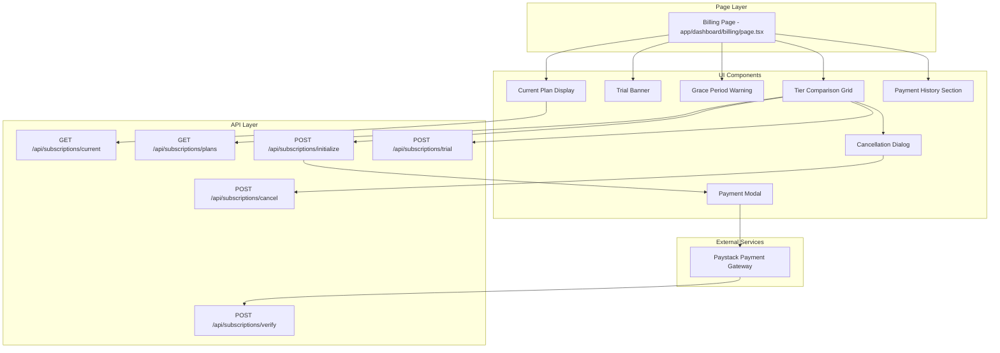
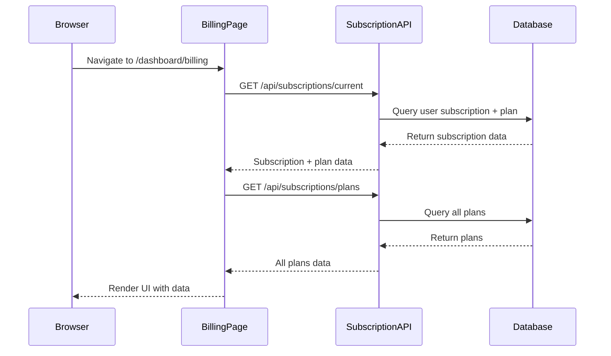
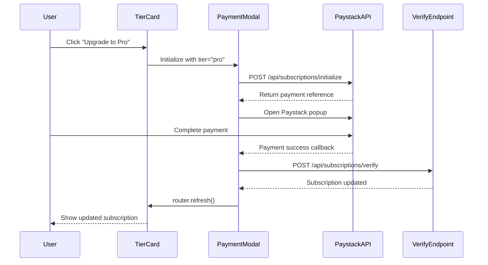

# Design Document

## Overview

This document specifies the technical design for updating the billing UI to display and manage the 3-tier subscription pricing system (Starter, Pro, Business). The design replaces the existing single-tier SubscriptionPayCard component with a comprehensive subscription management interface that integrates with the subscription API endpoints, displays tier comparisons, handles upgrades/downgrades, processes payments via Paystack, and manages subscription status displays.

### Key Design Goals

- **Clear Tier Comparison**: Display all three subscription tiers side-by-side with features, pricing, and limits
- **Status Awareness**: Show current subscription status with appropriate visual indicators and urgency levels
- **Seamless Upgrades**: Enable one-click upgrades with Paystack payment integration
- **Graceful Downgrades**: Handle downgrade flows with clear communication about timing and feature loss
- **Trial Management**: Display trial status and enable trial activation for new vendors
- **Payment History**: Provide access to past payments and invoice downloads
- **Mobile Responsive**: Ensure full functionality on mobile devices with touch-optimized interactions
- **Accessibility**: Meet WCAG AA standards for screen readers and keyboard navigation

## Architecture

### High-Level Component Architecture



### Component Responsibilities

| Component | Responsibilities |
|-----------|------------------|
| **Billing Page** | Server component that fetches subscription data and renders UI components |
| **Current Plan Display** | Shows vendor's active tier, status, and next billing date |
| **Trial Banner** | Displays trial status and days remaining with CTA for payment |
| **Grace Period Warning** | Shows urgent warning for past_due subscriptions |
| **Tier Comparison Grid** | Displays all three tiers with features, pricing, and action buttons |
| **Payment History Section** | Lists past subscription payments with invoice download |
| **Cancellation Dialog** | Confirms subscription cancellation with feature loss warning |
| **Payment Modal** | Initializes Paystack payment and handles callbacks |

## Components and Interfaces

### TypeScript Interfaces

```typescript
// app/lib/definitions.ts additions

export type SubscriptionStatusBadgeVariant = 'active' | 'trial' | 'past_due' | 'cancelled' | 'inactive';

export type SubscriptionUIData = {
  subscription: VendorSubscriptionInfo;
  plans: SubscriptionPlan[];
  paymentHistory: SubscriptionPayment[];
  productUsage: {
    current: number;
    limit: number;
    percentage: number;
  };
};

export type TierComparisonAction = 
  | { type: 'upgrade'; tier: SubscriptionTier }
  | { type: 'downgrade'; tier: SubscriptionTier }
  | { type: 'trial'; tier: SubscriptionTier }
  | { type: 'current' };

export type PaymentModalState = {
  isOpen: boolean;
  tier: SubscriptionTier | null;
  amount: number;
  reference: string | null;
};
```

### Component File Structure

```
app/
├── dashboard/
│   └── billing/
│       └── page.tsx                         # Server component - billing page
├── ui/
│   └── dashboard/
│       ├── subscription/
│       │   ├── current-plan-card.tsx        # Display current subscription
│       │   ├── trial-banner.tsx             # Trial status banner
│       │   ├── grace-period-warning.tsx     # Past due warning
│       │   ├── tier-comparison.tsx          # Three-tier comparison grid
│       │   ├── tier-card.tsx                # Individual tier card
│       │   ├── feature-list.tsx             # Feature availability list
│       │   ├── subscription-status-badge.tsx # Status indicator badge
│       │   ├── payment-history-section.tsx  # Payment list with invoices
│       │   ├── cancellation-dialog.tsx      # Confirm cancellation
│       │   └── payment-modal.tsx            # Paystack payment handler
│       ├── subscription-pay-card.tsx        # DEPRECATED - to be replaced
│       └── ...
├── lib/
│   ├── subscription-actions.ts              # Client actions for subscription management
│   ├── subscription-utils.ts                # Utility functions (date formatting, calculations)
│   └── ...
└── api/
    └── subscriptions/
        ├── current/route.ts                 # Existing - fetch subscription
        ├── plans/route.ts                   # Existing - fetch plans
        ├── initialize/route.ts              # Existing - initialize payment
        ├── trial/route.ts                   # Existing - start trial
        ├── verify/route.ts                  # Existing - verify payment
        └── cancel/route.ts                  # Existing - cancel subscription
```

## Data Flow

### 1. Page Load Data Flow



### 2. Upgrade Flow



## Component Specifications

### 1. Billing Page (Server Component)

**File:** `app/dashboard/billing/page.tsx`

**Purpose:** Server component that fetches all subscription data and renders the billing UI

**Data Fetching:**
```typescript
// Fetch subscription data
const subscriptionRes = await fetch(`${process.env.NEXT_PUBLIC_BASE_URL}/api/subscriptions/current`);
const { subscription } = await subscriptionRes.json();

// Fetch available plans
const plansRes = await fetch(`${process.env.NEXT_PUBLIC_BASE_URL}/api/subscriptions/plans`);
const { plans } = await plansRes.json();

// Fetch product usage
const productCount = await sql`SELECT COUNT(*) FROM products WHERE vendor_id = ${userId} AND status = 'active'`;
```

**Rendering Logic:**
- Display TrialBanner if subscription.status === 'trial'
- Display GracePeriodWarning if subscription.status === 'past_due'
- Always display CurrentPlanCard with subscription data
- Always display TierComparison with plans and current subscription
- Display PaymentHistorySection if vendor has payment history
- Maintain PayoutCard and PayoutHistory components (existing)

### 2. Current Plan Card

**File:** `app/ui/dashboard/subscription/current-plan-card.tsx`

**Props:**
```typescript
interface CurrentPlanCardProps {
  subscription: VendorSubscriptionInfo;
  productUsage: { current: number; limit: number; percentage: number };
}
```

**Features:**
- Display tier name prominently (Starter, Pro, Business)
- Show status badge with color coding (active=green, trial=blue, past_due=red, cancelled=gray, inactive=gray)
- Display next billing date or trial end date
- Show product usage (e.g., "8/10 products used")
- Highlight product usage in warning color if >= 90%
- Display transaction fee percentage for current tier
- Show "Cancel Subscription" button for active paid subscriptions

### 3. Tier Comparison Grid

**File:** `app/ui/dashboard/subscription/tier-comparison.tsx`

**Props:**
```typescript
interface TierComparisonProps {
  plans: SubscriptionPlan[];
  currentTier: SubscriptionTier;
  currentStatus: SubscriptionStatus;
  canStartTrial: boolean;
}
```

**Layout:**
- Three-column grid on desktop (lg:grid-cols-3)
- Single column stack on mobile (grid-cols-1)
- Highlight current tier with border and badge
- Each column renders a TierCard component

### 4. Tier Card

**File:** `app/ui/dashboard/subscription/tier-card.tsx`

**Props:**
```typescript
interface TierCardProps {
  plan: SubscriptionPlan;
  isCurrent: boolean;
  currentTier: SubscriptionTier;
  canStartTrial: boolean;
  onUpgrade: (tier: SubscriptionTier) => void;
  onDowngrade: (tier: SubscriptionTier) => void;
  onStartTrial: (tier: SubscriptionTier) => void;
}
```

**Features:**
- Display tier name and pricing (Free, ₦1,500/month, ₦3,500/month)
- Show product limit
- Show transaction fee percentage
- Render FeatureList with checkmarks/x-marks
- Display action button based on current tier:
  - If current: "Current Plan" (disabled)
  - If higher tier: "Upgrade" or "Start 14-Day Trial" button
  - If lower tier: "Downgrade" button

### 5. Payment Modal

**File:** `app/ui/dashboard/subscription/payment-modal.tsx`

**State:**
```typescript
const [isProcessing, setIsProcessing] = useState(false);
const [error, setError] = useState<string | null>(null);
```

**Paystack Integration:**
```typescript
const handlePayment = async (tier: SubscriptionTier, amount: number) => {
  // Initialize payment
  const response = await fetch('/api/subscriptions/initialize', {
    method: 'POST',
    body: JSON.stringify({ tier })
  });
  
  const { authorization_url, reference } = await response.json();
  
  // Open Paystack popup
  const handler = PaystackPop.setup({
    key: process.env.NEXT_PUBLIC_PAYSTACK_PUBLIC_KEY,
    email: user.email,
    amount: amount * 100,
    ref: reference,
    onClose: () => setIsProcessing(false),
    callback: async (response) => {
      await verifyPayment(response.reference);
    }
  });
  
  handler.openIframe();
};
```

### 6. Cancellation Dialog

**File:** `app/ui/dashboard/subscription/cancellation-dialog.tsx`

**Props:**
```typescript
interface CancellationDialogProps {
  isOpen: boolean;
  subscription: VendorSubscriptionInfo;
  onClose: () => void;
  onConfirm: () => Promise<void>;
}
```

**Features:**
- Display current tier and expiry date
- Explain that access continues until expiry date
- List features that will be lost
- Show "Cancel Subscription" and "Keep Subscription" buttons
- Handle cancellation API call and router.refresh()

## Utility Functions

### Date Formatting

**File:** `app/lib/subscription-utils.ts`

```typescript
export function formatSubscriptionDate(dateString: string | null): string {
  if (!dateString) return '';
  const date = new Date(dateString);
  return date.toLocaleDateString('en-US', { 
    year: 'numeric', 
    month: 'long', 
    day: 'numeric' 
  });
}

export function calculateDaysRemaining(expiryDate: string | null): number {
  if (!expiryDate) return 0;
  const expiry = new Date(expiryDate);
  const now = new Date();
  const diff = expiry.getTime() - now.getTime();
  return Math.max(0, Math.ceil(diff / (1000 * 60 * 60 * 24)));
}
```

### Client Actions

**File:** `app/lib/subscription-actions.ts`

```typescript
export async function upgradeSubscription(tier: SubscriptionTier): Promise<{ok: boolean; error?: string}> {
  const response = await fetch('/api/subscriptions/initialize', {
    method: 'POST',
    headers: { 'Content-Type': 'application/json' },
    body: JSON.stringify({ tier })
  });
  
  if (!response.ok) {
    const { error } = await response.json();
    return { ok: false, error };
  }
  
  return { ok: true };
}

export async function startTrial(tier: SubscriptionTier): Promise<{ok: boolean; error?: string}> {
  const response = await fetch('/api/subscriptions/trial', {
    method: 'POST',
    headers: { 'Content-Type': 'application/json' },
    body: JSON.stringify({ tier })
  });
  
  if (!response.ok) {
    const { error } = await response.json();
    return { ok: false, error };
  }
  
  return { ok: true };
}

export async function cancelSubscription(): Promise<{ok: boolean; error?: string}> {
  const response = await fetch('/api/subscriptions/cancel', {
    method: 'POST'
  });
  
  if (!response.ok) {
    const { error } = await response.json();
    return { ok: false, error };
  }
  
  return { ok: true };
}
```

## Styling Specifications

### Status Badge Colors

```typescript
const statusStyles = {
  active: 'bg-green-100 text-green-800',
  trial: 'bg-blue-100 text-blue-800',
  past_due: 'bg-red-100 text-red-800',
  cancelled: 'bg-gray-100 text-gray-800',
  inactive: 'bg-gray-100 text-gray-800'
};
```

### Tier Card Styling

- Current tier: `border-2 border-emerald-500`
- Other tiers: `border border-slate-200`
- Hover effect: `hover:border-emerald-300 transition-colors`

### Banner Styling

- Trial banner: `bg-blue-50 border-blue-200 text-blue-900`
- Grace period warning: `bg-red-50 border-red-200 text-red-900`
- Urgent (≤3 days): `bg-orange-50 border-orange-200 text-orange-900`

## Migration Strategy

### Phase 1: Create New Components (No Breaking Changes)

1. Create all new subscription UI components in `app/ui/dashboard/subscription/`
2. Keep existing SubscriptionPayCard component functional
3. Add new components to billing page alongside existing card

### Phase 2: Test New Components

1. Verify tier comparison displays correctly
2. Test upgrade flow with Paystack
3. Test trial activation
4. Test cancellation dialog
5. Verify responsive behavior on mobile

### Phase 3: Replace Old Component

1. Remove SubscriptionPayCard import from billing page
2. Remove SubscriptionPayCard component file
3. Update billing page layout to use new components exclusively

## Error Handling

### API Error Display

- Display error banners at top of page
- Include specific error message from API response
- Provide "Retry" button for failed actions
- Auto-dismiss success toasts after 5 seconds

### Payment Errors

- Display error message in payment modal
- Allow user to retry payment
- Log errors to console for debugging
- Handle Paystack script load failures

### Loading States

- Skeleton placeholders during initial data fetch
- Disabled buttons with spinner during API calls
- Loading overlay in payment modal during processing

## Accessibility Requirements

### Semantic HTML

- Use `<article>` for tier cards
- Use `<section>` for major page sections
- Use proper heading hierarchy (h1 → h2 → h3)

### ARIA Labels

- Add aria-label to status badges: "Subscription status: Active"
- Add aria-label to action buttons: "Upgrade to Pro tier for ₦1,500 per month"
- Add role="alert" to trial banner and grace period warning
- Add aria-describedby to feature badges

### Keyboard Navigation

- Ensure all interactive elements are keyboard accessible
- Implement focus trap in payment modal
- Provide visible focus indicators (ring-2 ring-emerald-500)
- Support Escape key to close dialogs

### Color Contrast

- Maintain 4.5:1 contrast ratio for all text
- Use Tailwind's default color system which meets WCAG AA
- Test with color blindness simulation tools

## Performance Considerations

### Server-Side Rendering

- Billing page is a server component (no client-side hydration)
- Fetch subscription data on server to avoid waterfalls
- Use React Suspense boundaries for progressive loading

### Client-Side Optimization

- Only payment modal and tier comparison are client components
- Use React.memo for tier cards to prevent unnecessary re-renders
- Debounce payment button clicks to prevent double submissions

### API Optimization

- Cache subscription plans data (static, rarely changes)
- Use SWR or React Query for client-side data fetching (if needed)
- Implement rate limiting on subscription endpoints

## Testing Strategy

### Unit Tests

- Test date formatting utilities
- Test status badge color logic
- Test product usage percentage calculation
- Test days remaining calculation

### Integration Tests

- Test upgrade flow end-to-end
- Test downgrade flow with cancellation dialog
- Test trial activation flow
- Test payment verification

### Manual Testing Checklist

- [ ] All three tiers display correctly
- [ ] Current tier is highlighted
- [ ] Status badges show correct colors
- [ ] Trial banner displays for trial subscriptions
- [ ] Grace period warning displays for past_due
- [ ] Upgrade button initiates payment
- [ ] Payment succeeds and updates subscription
- [ ] Downgrade shows cancellation dialog
- [ ] Cancellation updates status correctly
- [ ] Payment history displays
- [ ] Mobile responsive layout works
- [ ] Keyboard navigation works
- [ ] Screen reader announces status changes

## Rollback Plan

If critical issues arise after deployment:

1. Revert billing page to use old SubscriptionPayCard component
2. Keep new subscription API endpoints active (backward compatible)
3. Fix issues in new components
4. Re-deploy when ready

## Future Enhancements

- Add transaction fee calculator widget
- Add subscription analytics (MRR, churn rate)
- Add proration calculations for mid-cycle upgrades
- Add automatic retry for failed payments
- Add email notifications for subscription events
- Add custom domain configuration UI (Business tier)
- Add team member management UI (Business tier)

