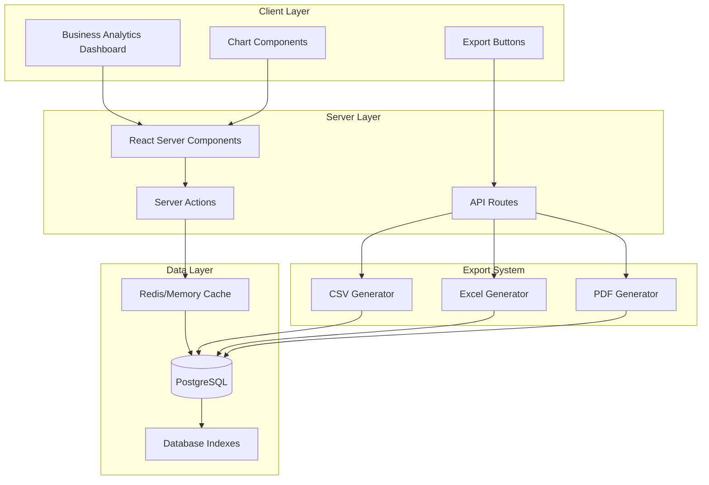

# Design Document: Business-tier Advanced Analytics

## Overview

This design document details the technical architecture for implementing Business-tier exclusive advanced analytics capabilities in Ovend. The feature provides Business tier vendors (₦3,500/month) with substantially more powerful analytics than Pro tier (₦1,500/month), including:

- **Extended time range analytics** (30-day, 90-day, custom ranges vs Pro's 7-day limit)
- **Customer analytics** (repeat rate, CLV, AOV trends)
- **Product performance deep-dive** (inventory velocity, low performers, profit margins)
- **Advanced conversion metrics** (funnel analysis, abandonment rates)
- **Comparative analytics** (WoW, MoM, YoY growth tracking)
- **Revenue forecasting** (30-day projections using linear regression)
- **Analytics export** (CSV, Excel, PDF)
- **Real-time dashboard** (live performance monitoring)
- **Geographic insights** (city/state-level analytics)
- **Enhanced visualizations** (trend lines, interactive charts, sparklines)

The design leverages existing database infrastructure (`store_analytics`, `orders`, `products`, `users` tables) without requiring new tracking mechanisms. The solution emphasizes performance through caching, optimized queries, and incremental data loading.

### Design Principles


1. **Performance First**: Use caching, database indexes, and optimized aggregations
2. **Progressive Enhancement**: Load summary data first, then detailed analytics
3. **Tier-Based Access**: Graceful degradation from Business → Pro → Starter
4. **Existing Infrastructure**: No new tracking systems; use current tables
5. **Scalability**: Support vendors with 10,000+ orders efficiently

## Architecture

### System Components



### Data Flow

**Primary Analytics Flow:**
1. User loads Business Analytics Dashboard (React Server Component)
2. Server checks subscription tier (`users.subscription_tier`)
3. If Business tier: Fetch cached analytics or query database
4. Aggregate data at server (reduce client payload)
5. Return pre-computed metrics to client
6. Client renders interactive charts

**Export Flow:**
1. User clicks "Export as CSV/Excel/PDF"
2. Client sends POST request to `/api/analytics/export`
3. API route verifies Business tier subscription
4. Query database for requested date range
5. Generate file using appropriate library
6. Stream file to client as download

**Real-Time Update Flow:**
1. New order created via Server Action
2. Server Action calls `updateAnalytics(vendorId, date)`
3. Analytics aggregates updated in `store_analytics` table
4. Cache invalidated for affected vendor + date
5. Real-time dashboard polls every 30 seconds (client-side)

## Components and Interfaces

### Database Schema Changes

**1. Enhanced Analytics Aggregation (store_analytics table)**

No schema changes needed. Current schema sufficient:
```sql
CREATE TABLE store_analytics (
  id UUID PRIMARY KEY DEFAULT gen_random_uuid(),
  vendor_id UUID NOT NULL REFERENCES users(id),
  date DATE NOT NULL DEFAULT CURRENT_DATE,
  visits INT DEFAULT 0,
  orders_count INT DEFAULT 0,
  revenue INT DEFAULT 0,
  UNIQUE(vendor_id, date)
);
```

**2. Database Indexes for Performance**

Add indexes to optimize analytics queries:

```sql
-- Primary indexes for analytics queries
CREATE INDEX IF NOT EXISTS idx_store_analytics_vendor_date 
  ON store_analytics(vendor_id, date DESC);

CREATE INDEX IF NOT EXISTS idx_orders_vendor_status_date 
  ON orders(vendor_id, status, created_at DESC);

CREATE INDEX IF NOT EXISTS idx_orders_customer_phone 
  ON orders(customer_phone) 
  WHERE customer_phone IS NOT NULL;

-- Index for geographic queries
CREATE INDEX IF NOT EXISTS idx_orders_customer_address 
  ON orders USING gin(to_tsvector('english', customer_address)) 
  WHERE customer_address IS NOT NULL;

-- Index for product performance
CREATE INDEX IF NOT EXISTS idx_products_vendor_status 
  ON products(vendor_id, status) 
  WHERE status = 'active';
```

**3. Orders Table Enhancement**


Add `fulfilled_at` timestamp for precise time-to-fulfillment calculations:

```sql
ALTER TABLE orders 
  ADD COLUMN IF NOT EXISTS fulfilled_at TIMESTAMPTZ DEFAULT NULL;

-- Backfill fulfilled_at for existing fulfilled orders (one-time migration)
UPDATE orders 
SET fulfilled_at = created_at + INTERVAL '2 hours' 
WHERE status = 'fulfilled' AND fulfilled_at IS NULL;
```

### Data Layer Functions

Create new analytics data functions in `app/lib/business-analytics.ts`:

```typescript
// Type definitions
export type TimeRange = '7d' | '30d' | '90d' | 'custom';

export type DateRange = {
  startDate: string; // ISO date string
  endDate: string;   // ISO date string
};

export type AnalyticsSummary = {
  totalVisits: number;
  totalOrders: number;
  totalRevenue: number;
  conversionRate: number;
  avgOrderValue: number;
  periodChange: PeriodComparison;
};

export type PeriodComparison = {
  visits: { value: number; change: number; direction: 'up' | 'down' | 'neutral' };
  orders: { value: number; change: number; direction: 'up' | 'down' | 'neutral' };
  revenue: { value: number; change: number; direction: 'up' | 'down' | 'neutral' };
  conversionRate: { value: number; change: number; direction: 'up' | 'down' | 'neutral' };
};

export type CustomerMetrics = {
  repeatCustomerRate: number;
  newCustomers: number;
  returningCustomers: number;
  averageLifetimeValue: number;
  totalUniqueCustomers: number;
};

export type ProductPerformance = {
  productId: string;
  productName: string;
  unitsSold: number;
  totalRevenue: number;
  inventoryVelocity: number; // days between sales
  salesTrend: 'up' | 'down' | 'stable';
  discountPercentage: number | null;
  category: string | null;
};

export type ConversionFunnel = {
  visits: number;
  ordersInitiated: number;
  ordersCompleted: number;
  visitToOrderRate: number;
  orderCompletionRate: number;
  abandonmentRate: number;
  avgTimeToFulfillment: number; // in hours
};

export type GeographicInsight = {
  city: string;
  state: string;
  orderCount: number;
  revenue: number;
  percentageOfTotal: number;
};

export type RevenueForecast = {
  forecastedRevenue: number;
  confidence: 'high' | 'medium' | 'low';
  historicalDays: number;
  dailyProjections: Array<{ date: string; projected: number }>;
  seasonalTrend: 'above' | 'below' | 'average' | null;
};
```

**Core Data Functions:**

```typescript
/**
 * Fetch analytics summary for a given date range
 * Uses caching with 5-minute TTL
 */
export async function fetchAnalyticsSummary(
  vendorId: string,
  range: DateRange
): Promise<AnalyticsSummary> {
  const cacheKey = `analytics:${vendorId}:${range.startDate}:${range.endDate}`;
  
  // Check cache first
  const cached = await getFromCache(cacheKey);
  if (cached) return cached;
  
  // Query aggregated data from store_analytics
  const currentPeriod = await sql`
    SELECT 
      SUM(visits) as total_visits,
      SUM(orders_count) as total_orders,
      SUM(revenue) as total_revenue
    FROM store_analytics
    WHERE vendor_id = ${vendorId}
      AND date >= ${range.startDate}::date
      AND date <= ${range.endDate}::date
  `;
  
  const conversionRate = currentPeriod[0].total_visits > 0
    ? (currentPeriod[0].total_orders / currentPeriod[0].total_visits) * 100
    : 0;
  
  const avgOrderValue = currentPeriod[0].total_orders > 0
    ? currentPeriod[0].total_revenue / currentPeriod[0].total_orders
    : 0;
  
  // Calculate period comparison
  const daysDiff = differenceInDays(range.endDate, range.startDate);
  const previousStart = subDays(range.startDate, daysDiff);
  const previousEnd = subDays(range.endDate, daysDiff);
  
  const previousPeriod = await sql`
    SELECT 
      SUM(visits) as total_visits,
      SUM(orders_count) as total_orders,
      SUM(revenue) as total_revenue
    FROM store_analytics
    WHERE vendor_id = ${vendorId}
      AND date >= ${previousStart}::date
      AND date <= ${previousEnd}::date
  `;
  
  const periodChange = calculatePeriodChange(currentPeriod[0], previousPeriod[0]);
  
  const result = {
    totalVisits: currentPeriod[0].total_visits,
    totalOrders: currentPeriod[0].total_orders,
    totalRevenue: currentPeriod[0].total_revenue,
    conversionRate,
    avgOrderValue,
    periodChange
  };
  
  // Cache for 5 minutes
  await setCache(cacheKey, result, 300);
  
  return result;
}

/**
 * Fetch customer analytics metrics
 */
export async function fetchCustomerMetrics(
  vendorId: string,
  range: DateRange
): Promise<CustomerMetrics> {
  // Identify unique customers and their order counts
  const customerData = await sql`
    WITH customer_orders AS (
      SELECT 
        customer_phone,
        COUNT(*) as order_count,
        SUM(total_amount) as lifetime_value,
        MIN(created_at) as first_order_date
      FROM orders
      WHERE vendor_id = ${vendorId}
        AND status = 'fulfilled'
        AND customer_phone IS NOT NULL
      GROUP BY customer_phone
    ),
    period_customers AS (
      SELECT 
        customer_phone,
        order_count,
        lifetime_value
      FROM customer_orders
      WHERE first_order_date >= ${range.startDate}::date
        AND first_order_date <= ${range.endDate}::date
    )
    SELECT 
      COUNT(*) as total_customers,
      COUNT(CASE WHEN order_count > 1 THEN 1 END) as repeat_customers,
      AVG(lifetime_value) as avg_ltv,
      SUM(CASE WHEN order_count = 1 THEN 1 ELSE 0 END) as new_customers,
      SUM(CASE WHEN order_count > 1 THEN 1 ELSE 0 END) as returning_customers
    FROM period_customers
  `;
  
  const data = customerData[0];
  
  return {
    repeatCustomerRate: data.total_customers > 0 
      ? (data.repeat_customers / data.total_customers) * 100 
      : 0,
    newCustomers: data.new_customers || 0,
    returningCustomers: data.returning_customers || 0,
    averageLifetimeValue: data.avg_ltv || 0,
    totalUniqueCustomers: data.total_customers || 0
  };
}

/**
 * Fetch product performance data with pagination
 */
export async function fetchProductPerformance(
  vendorId: string,
  range: DateRange,
  options: { 
    page?: number; 
    limit?: number; 
    sortBy?: 'revenue' | 'units' | 'velocity' | 'name';
    category?: string;
  } = {}
): Promise<{ products: ProductPerformance[]; totalCount: number }> {
  const page = options.page || 1;
  const limit = options.limit || 25;
  const offset = (page - 1) * limit;
  
  const sortColumn = {
    revenue: 'total_revenue DESC',
    units: 'units_sold DESC',
    velocity: 'inventory_velocity ASC',
    name: 'p.name ASC'
  }[options.sortBy || 'revenue'];
  
  const categoryFilter = options.category 
    ? sql`AND p.category = ${options.category}` 
    : sql``;
  
  const products = await sql`
    WITH product_sales AS (
      SELECT
        p.id as product_id,
        p.name as product_name,
        p.category,
        p.compare_at_price,
        p.price,
        SUM(oi.quantity)::int AS units_sold,
        SUM(oi.price * oi.quantity)::int AS total_revenue,
        COUNT(DISTINCT DATE(o.created_at)) as days_with_sales
      FROM products p
      LEFT JOIN orders o ON o.vendor_id = ${vendorId}
        AND o.status = 'fulfilled'
        AND o.created_at >= ${range.startDate}::date
        AND o.created_at <= ${range.endDate}::date
      LEFT JOIN LATERAL jsonb_to_recordset(
        CASE WHEN jsonb_typeof(o.items) = 'array' THEN o.items ELSE '[]'::jsonb END
      ) AS oi("productId" text, name text, price int, quantity int)
        ON oi."productId"::uuid = p.id
      WHERE p.vendor_id = ${vendorId}
        AND p.status = 'active'
        ${categoryFilter}
      GROUP BY p.id, p.name, p.category, p.compare_at_price, p.price
    )
    SELECT 
      product_id::text,
      product_name,
      category,
      units_sold,
      total_revenue,
      CASE 
        WHEN units_sold > 0 THEN 
          EXTRACT(DAY FROM (${range.endDate}::date - ${range.startDate}::date))::float / units_sold
        ELSE 999
      END as inventory_velocity,
      CASE
        WHEN compare_at_price IS NOT NULL AND compare_at_price > price THEN
          ((compare_at_price - price)::float / compare_at_price * 100)::int
        ELSE NULL
      END as discount_percentage,
      CASE 
        WHEN days_with_sales >= 2 THEN 'stable'
        WHEN days_with_sales = 1 THEN 'down'
        ELSE 'stable'
      END as sales_trend
    FROM product_sales
    ORDER BY ${sql.unsafe(sortColumn)}
    LIMIT ${limit} OFFSET ${offset}
  `;
  
  const countResult = await sql`
    SELECT COUNT(DISTINCT p.id) as total
    FROM products p
    WHERE p.vendor_id = ${vendorId}
      AND p.status = 'active'
      ${categoryFilter}
  `;
  
  return {
    products: products.map(p => ({
      productId: p.product_id,
      productName: p.product_name,
      unitsSold: p.units_sold || 0,
      totalRevenue: p.total_revenue || 0,
      inventoryVelocity: p.inventory_velocity,
      salesTrend: p.sales_trend,
      discountPercentage: p.discount_percentage,
      category: p.category
    })),
    totalCount: countResult[0].total
  };
}
```


### UI Component Structure

**Component Hierarchy:**

```
app/dashboard/analytics/
├── page.tsx                          (Main analytics page - RSC)
├── business-analytics-dashboard.tsx  (Client wrapper component)
└── components/
    ├── time-range-selector.tsx       (7d/30d/90d/custom picker)
    ├── analytics-summary-cards.tsx   (Visits, Orders, Revenue, Conv Rate)
    ├── period-comparison-badge.tsx   (WoW/MoM/YoY indicators)
    ├── customer-metrics-section.tsx  (Repeat rate, CLV, AOV)
    ├── product-performance-table.tsx (Sortable table with pagination)
    ├── conversion-funnel-chart.tsx   (Funnel visualization)
    ├── revenue-forecast-card.tsx     (30-day projection)
    ├── geographic-insights-map.tsx   (City/state breakdown)
    ├── real-time-dashboard.tsx       (Live today's performance)
    ├── trend-chart.tsx               (Reusable line/bar chart)
    ├── export-menu.tsx               (CSV/Excel/PDF export buttons)
    └── business-tier-gate.tsx        (Upgrade prompt for Pro users)
```

**Main Page Component** (`app/dashboard/analytics/page.tsx`):

```typescript
import { auth } from '@/auth';
import { getVendorSubscription } from '@/app/lib/subscriptions';
import { redirect } from 'next/navigation';
import BusinessAnalyticsDashboard from './business-analytics-dashboard';
import ProAnalyticsView from './pro-analytics-view';

export default async function AnalyticsPage() {
  const session = await auth();
  if (!session?.user?.id) {
    redirect('/customer/login');
  }
  
  const subscription = await getVendorSubscription(session.user.id);
  const tier = subscription?.tier || 'starter';
  
  // Business tier: Full analytics
  if (tier === 'business') {
    return <BusinessAnalyticsDashboard vendorId={session.user.id} />;
  }
  
  // Pro tier: Basic analytics with upgrade prompts
  if (tier === 'pro') {
    return <ProAnalyticsView vendorId={session.user.id} tier="pro" />;
  }
  
  // Starter tier: Limited analytics
  return <ProAnalyticsView vendorId={session.user.id} tier="starter" />;
}
```

**Time Range Selector Component:**

```typescript
'use client';

import { useState } from 'react';
import { CalendarIcon } from '@heroicons/react/24/outline';
import DatePicker from 'react-datepicker';

export type TimeRange = '7d' | '30d' | '90d' | 'custom';

interface TimeRangeSelectorProps {
  value: TimeRange;
  customRange?: { startDate: Date; endDate: Date };
  onChange: (range: TimeRange, customRange?: { startDate: Date; endDate: Date }) => void;
}

export default function TimeRangeSelector({ value, customRange, onChange }: TimeRangeSelectorProps) {
  const [showCustomPicker, setShowCustomPicker] = useState(false);
  const [startDate, setStartDate] = useState<Date>(customRange?.startDate || new Date());
  const [endDate, setEndDate] = useState<Date>(customRange?.endDate || new Date());
  
  const ranges = [
    { value: '7d', label: '7 Days' },
    { value: '30d', label: '30 Days' },
    { value: '90d', label: '90 Days' },
    { value: 'custom', label: 'Custom Range' }
  ];
  
  const handleRangeChange = (newRange: TimeRange) => {
    if (newRange === 'custom') {
      setShowCustomPicker(true);
    } else {
      setShowCustomPicker(false);
      onChange(newRange);
    }
  };
  
  const handleCustomApply = () => {
    onChange('custom', { startDate, endDate });
    setShowCustomPicker(false);
  };
  
  return (
    <div className="flex items-center gap-2">
      {ranges.map(range => (
        <button
          key={range.value}
          onClick={() => handleRangeChange(range.value as TimeRange)}
          className={`px-4 py-2 rounded-lg font-medium transition ${
            value === range.value
              ? 'bg-emerald-600 text-white'
              : 'bg-slate-100 text-slate-700 hover:bg-slate-200'
          }`}
        >
          {range.label}
        </button>
      ))}
      
      {showCustomPicker && (
        <div className="fixed inset-0 bg-black/50 flex items-center justify-center z-50">
          <div className="bg-white rounded-xl p-6 shadow-2xl">
            <h3 className="font-bold mb-4">Select Custom Range</h3>
            <div className="flex gap-4 mb-4">
              <DatePicker
                selected={startDate}
                onChange={(date) => setStartDate(date || new Date())}
                selectsStart
                startDate={startDate}
                endDate={endDate}
                maxDate={new Date()}
                inline
              />
              <DatePicker
                selected={endDate}
                onChange={(date) => setEndDate(date || new Date())}
                selectsEnd
                startDate={startDate}
                endDate={endDate}
                minDate={startDate}
                maxDate={new Date()}
                inline
              />
            </div>
            <div className="flex gap-2 justify-end">
              <button
                onClick={() => setShowCustomPicker(false)}
                className="px-4 py-2 rounded-lg bg-slate-100 hover:bg-slate-200"
              >
                Cancel
              </button>
              <button
                onClick={handleCustomApply}
                className="px-4 py-2 rounded-lg bg-emerald-600 text-white hover:bg-emerald-700"
              >
                Apply
              </button>
            </div>
          </div>
        </div>
      )}
    </div>
  );
}
```

**Real-Time Dashboard Component:**

```typescript
'use client';

import { useState, useEffect } from 'react';
import { fetchTodayPerformance } from '@/app/lib/business-analytics';

export default function RealTimeDashboard({ vendorId }: { vendorId: string }) {
  const [data, setData] = useState<{
    todayVisits: number;
    todayOrders: number;
    todayRevenue: number;
    lastHourOrders: number;
    comparisonYesterday: { visits: number; orders: number; revenue: number };
    paceIndicator: 'ahead' | 'behind' | 'on-track';
    lastUpdate: string;
  } | null>(null);
  
  useEffect(() => {
    const fetchData = async () => {
      const result = await fetch(`/api/analytics/real-time?vendorId=${vendorId}`);
      const json = await result.json();
      setData(json);
    };
    
    // Initial fetch
    fetchData();
    
    // Poll every 30 seconds
    const interval = setInterval(fetchData, 30000);
    
    return () => clearInterval(interval);
  }, [vendorId]);
  
  if (!data) return <div>Loading...</div>;
  
  return (
    <div className="bg-white rounded-2xl border border-slate-200 p-6">
      <h3 className="text-lg font-bold mb-4">Live Performance Today</h3>
      
      <div className="grid grid-cols-3 gap-4 mb-6">
        <MetricCard
          label="Visits"
          value={data.todayVisits}
          comparison={data.comparisonYesterday.visits}
          comparisonLabel="vs yesterday"
        />
        <MetricCard
          label="Orders"
          value={data.todayOrders}
          comparison={data.comparisonYesterday.orders}
          comparisonLabel="vs yesterday"
        />
        <MetricCard
          label="Revenue"
          value={`₦${(data.todayRevenue / 100).toLocaleString()}`}
          comparison={data.comparisonYesterday.revenue}
          comparisonLabel="vs yesterday"
        />
      </div>
      
      <div className="flex items-center justify-between text-sm">
        <div className="flex items-center gap-2">
          <span className="text-slate-600">Pace:</span>
          <span className={`font-bold ${
            data.paceIndicator === 'ahead' ? 'text-emerald-600' :
            data.paceIndicator === 'behind' ? 'text-red-600' :
            'text-slate-600'
          }`}>
            {data.paceIndicator === 'ahead' ? '↑ Ahead of yesterday' :
             data.paceIndicator === 'behind' ? '↓ Behind yesterday' :
             '→ On track'}
          </span>
        </div>
        <span className="text-slate-400">Last updated: {data.lastUpdate}</span>
      </div>
      
      <div className="mt-4 p-3 bg-emerald-50 rounded-lg">
        <span className="text-sm font-medium text-emerald-800">
          {data.lastHourOrders} order{data.lastHourOrders !== 1 ? 's' : ''} in the last hour
        </span>
      </div>
    </div>
  );
}
```


## Data Models

### Core Data Types

All data models defined in `app/lib/business-analytics.ts` (see Components and Interfaces section above).

### Caching Strategy

**Cache Implementation:**

Use Node.js in-memory cache with LRU eviction:

```typescript
// app/lib/cache.ts
import { LRUCache } from 'lru-cache';

const analyticsCache = new LRUCache<string, any>({
  max: 500, // Maximum 500 entries
  ttl: 1000 * 60 * 5, // 5 minutes TTL
  updateAgeOnGet: false,
  updateAgeOnHas: false
});

export async function getFromCache(key: string) {
  return analyticsCache.get(key);
}

export async function setCache(key: string, value: any, ttlSeconds?: number) {
  analyticsCache.set(key, value, { 
    ttl: ttlSeconds ? ttlSeconds * 1000 : undefined 
  });
}

export function invalidateCache(pattern: string) {
  // Invalidate all keys matching pattern
  const keys = Array.from(analyticsCache.keys());
  keys.forEach(key => {
    if (key.includes(pattern)) {
      analyticsCache.delete(key);
    }
  });
}
```


**Cache Keys:**
- `analytics:{vendorId}:{startDate}:{endDate}` - Summary data
- `customers:{vendorId}:{startDate}:{endDate}` - Customer metrics
- `products:{vendorId}:{startDate}:{endDate}:{page}:{sort}` - Product performance
- `forecast:{vendorId}` - Revenue forecast (cached for 24 hours)

**Cache Invalidation:**
- On new order creation: Invalidate `analytics:{vendorId}:*` for today's date
- On order status change: Invalidate affected date ranges
- Manual invalidation: Admin button to clear all vendor analytics cache

## Error Handling

### Error Scenarios and Responses

**1. Insufficient Data**

When vendor has < 5 orders:
```typescript
if (totalOrders < 5) {
  return {
    type: 'insufficient_data',
    message: 'You need at least 5 completed orders to see customer analytics.',
    suggestion: 'Keep sharing your store link to get more orders!'
  };
}
```

**2. Date Range Too Large**

Maximum 365-day range for exports:
```typescript
if (daysDiff > 365) {
  throw new ValidationError('Date range cannot exceed 365 days for exports');
}
```

**3. Query Timeout**

For long-running queries (>10 seconds):
```typescript
try {
  const result = await Promise.race([
    fetchAnalyticsData(vendorId, range),
    new Promise((_, reject) => 
      setTimeout(() => reject(new Error('Query timeout')), 10000)
    )
  ]);
  return result;
} catch (error) {
  if (error.message === 'Query timeout') {
    return {
      type: 'timeout',
      message: 'Analytics is taking longer than expected. Try a smaller date range.',
      suggestion: 'Reduce your date range to 30 days or less'
    };
  }
  throw error;
}
```

**4. Tier Access Violation**

When non-Business tier user attempts access:
```typescript
if (userTier !== 'business') {
  redirect('/dashboard/billing?upgrade=business&reason=analytics');
}
```

**5. Export Generation Failure**

When export file generation fails:
```typescript
try {
  const file = await generateExport(data, format);
  return file;
} catch (error) {
  logger.error('Export generation failed', { vendorId, format, error });
  throw new ExportError(
    'Failed to generate export file. Please try again or contact support.',
    { recoverable: true, suggestedAction: 'retry' }
  );
}
```

**6. Cache Miss Degradation**

When cache is unavailable, degrade gracefully:
```typescript
async function getCachedAnalytics(key: string, fallback: () => Promise<any>) {
  try {
    const cached = await getFromCache(key);
    if (cached) return cached;
  } catch (cacheError) {
    logger.warn('Cache unavailable, using fallback', { key, error: cacheError });
  }
  
  // Always compute fallback if cache fails or misses
  return await fallback();
}
```

**7. Invalid Date Range**

When user provides invalid dates:
```typescript
function validateDateRange(startDate: string, endDate: string): ValidationResult {
  const start = new Date(startDate);
  const end = new Date(endDate);
  
  if (isNaN(start.getTime()) || isNaN(end.getTime())) {
    return { valid: false, error: 'Invalid date format' };
  }
  
  if (start > end) {
    return { valid: false, error: 'Start date must be before end date' };
  }
  
  if (end > new Date()) {
    return { valid: false, error: 'End date cannot be in the future' };
  }
  
  const daysDiff = differenceInDays(end, start);
  if (daysDiff > 365) {
    return { valid: false, error: 'Date range cannot exceed 365 days' };
  }
  
  return { valid: true };
}
```

**8. Database Connection Failure**

When database is unavailable:
```typescript
try {
  const data = await sql`SELECT ...`;
  return data;
} catch (error) {
  if (error.code === 'ECONNREFUSED' || error.code === 'ETIMEDOUT') {
    logger.error('Database connection failed', { error });
    return {
      type: 'service_unavailable',
      message: 'Analytics is temporarily unavailable. Please try again in a few moments.',
      retryAfter: 30
    };
  }
  throw error;
}
```

**9. Missing Required Data**

When analytics cannot be computed due to missing data:
```typescript
if (!vendor.store_slug) {
  return {
    type: 'incomplete_setup',
    message: 'Complete your store setup to access analytics.',
    ctaLink: '/dashboard/settings',
    ctaText: 'Complete Setup'
  };
}
```

**10. Malformed Customer Address Data**

When parsing geographic data from addresses:
```typescript
function extractLocationFromAddress(address: string | null): { city: string; state: string } | null {
  if (!address) return null;
  
  try {
    // Attempt to parse address using common Nigerian address formats
    const parts = address.split(',').map(s => s.trim());
    if (parts.length >= 2) {
      return {
        city: parts[parts.length - 2],
        state: parts[parts.length - 1]
      };
    }
  } catch (error) {
    logger.debug('Failed to parse address', { address, error });
  }
  
  return null; // Gracefully handle unparseable addresses
}


## Correctness Properties

*A property is a characteristic or behavior that should hold true across all valid executions of a system—essentially, a formal statement about what the system should do. Properties serve as the bridge between human-readable specifications and machine-verifiable correctness guarantees.*

### Property 1: Date Range Calculation Accuracy

*For any* non-negative integer `n` representing days, the `calculateDateRange(n)` function SHALL return a start date and end date where the difference between end date and start date equals exactly `n` days.

**Validates: Requirements 1.2, 1.3**

### Property 2: Date Range Validation

*For any* date range with start date and end date, if the span exceeds 365 days, the validation function SHALL reject the range and return an error.

**Validates: Requirements 1.5, 7.9**

### Property 3: Repeat Customer Rate Calculation

*For any* set of customer order data, the calculated repeat customer rate SHALL equal `(count of customers with 2 or more orders / total unique customers) × 100`, with the result being a valid percentage between 0 and 100 inclusive.

**Validates: Requirements 2.2**

### Property 4: Customer Lifetime Value Aggregation

*For any* set of orders grouped by customer phone number, the calculated Customer Lifetime Value for each customer SHALL equal the sum of all order values (total_amount) for that customer's phone number.

**Validates: Requirements 2.4**

### Property 5: Average Order Value Calculation

*For any* non-empty set of orders with positive revenue, the calculated Average Order Value SHALL equal total revenue divided by order count, and SHALL be greater than zero.

**Validates: Requirements 2.6**

### Property 6: Returning Customer Identification

*For any* customer phone number appearing in multiple orders, the system SHALL classify that customer as "returning", and *for any* phone number appearing in exactly one order, SHALL classify as "new".

**Validates: Requirements 2.9**

### Property 7: Inventory Velocity Calculation

*For any* product with units sold greater than zero during a time period, the calculated inventory velocity SHALL equal the time period duration in days divided by units sold, and SHALL be a positive number.

**Validates: Requirements 3.3**

### Property 8: Sorting Correctness

*For any* list of items and any sortable property, after applying sort by that property in ascending order, each element SHALL be less than or equal to its successor according to that property's ordering.

**Validates: Requirements 3.4, 9.2, 9.3**

### Property 9: Low-Performing Product Identification

*For any* set of active products with sales data, products with exactly zero sales in the evaluated period SHALL be classified as low-performing, and products with one or more sales SHALL NOT be classified as low-performing.

**Validates: Requirements 3.5**

### Property 10: Discount Percentage Calculation

*For any* product where `compare_at_price` is set and greater than `price`, the calculated discount percentage SHALL equal `((compare_at_price - price) / compare_at_price) × 100`, and SHALL be between 0 and 100 exclusive.

**Validates: Requirements 3.8**

### Property 11: Category Filtering

*For any* product list and category filter value, the filtered result SHALL contain only products where the product's category matches the filter value exactly.

**Validates: Requirements 3.10**

### Property 12: Conversion Rate Calculation

*For any* two funnel stages where the current stage count is greater than zero, the conversion rate from current stage to next stage SHALL equal `(next_stage_count / current_stage_count) × 100`, and SHALL be a percentage between 0 and 100 inclusive.

**Validates: Requirements 4.2, 4.3, 4.4**

### Property 13: Abandonment and Completion Complementarity

*For any* set of orders, the sum of order completion rate and order abandonment rate SHALL equal 100%, where completion rate is the percentage of fulfilled orders and abandonment rate is the percentage of non-fulfilled orders.

**Validates: Requirements 4.5**

### Property 14: Average Duration Calculation

*For any* non-empty set of completed orders with valid created_at and fulfilled_at timestamps, the average time to fulfillment SHALL equal the sum of all (fulfilled_at - created_at) durations divided by the count of orders.

**Validates: Requirements 4.6**

### Property 15: Period-Over-Period Change Calculation

*For any* two numeric period values where the previous period value is non-zero, the calculated percentage change SHALL equal `((current - previous) / previous) × 100`.

**Validates: Requirements 4.9**

### Property 16: Highest Growth Metric Identification

*For any* non-empty set of metrics with calculated percentage changes, the identified "highest growth metric" SHALL be the metric with the maximum percentage change value.

**Validates: Requirements 5.9**

### Property 17: Forecast Confidence Classification

*For any* historical data set, if the data spans 90 or more days the confidence SHALL be "High", if 30-89 days SHALL be "Medium", if less than 30 days SHALL be "Low".

**Validates: Requirements 6.4**

### Property 18: CSV Export Format Validity

*For any* analytics data set exported to CSV format, the resulting file SHALL be valid CSV (parseable by standard CSV parsers), and SHALL contain all the original data fields without data loss.

**Validates: Requirements 7.2**

### Property 19: Excel Export Structure

*For any* analytics data set exported to Excel format, the resulting file SHALL be valid Excel format (.xlsx), SHALL contain all specified sheets (Summary, Daily Metrics, Product Performance, Customer Analytics), and SHALL preserve all data values.

**Validates: Requirements 7.4**

### Property 20: Export Filename Format

*For any* export with store name, date range, and export date, the generated filename SHALL match the pattern `Ovend-Analytics-{StoreName}-{DateRange}-{ExportDate}.{extension}` exactly.

**Validates: Requirements 7.6**

### Property 21: Same-Time-Yesterday Comparison

*For any* current date-time and metric value, when comparing to "same time yesterday", the comparison SHALL use data from exactly 24 hours prior to the current time.

**Validates: Requirements 8.3**

### Property 22: Same-Weekday-Last-Week Comparison

*For any* current date and metric value, when comparing to "same weekday last week", the comparison SHALL use data from exactly 7 days prior to the current date.

**Validates: Requirements 8.5**

### Property 23: Pace Indicator Logic

*For any* current performance value and target value, if the projected end-of-day value exceeds the target, the pace indicator SHALL show "ahead"; if below the target SHALL show "behind"; if equal SHALL show "on-track".

**Validates: Requirements 8.8**

### Property 24: Geographic Ranking

*For any* set of geographic regions with associated order counts or revenue, the top N ranking SHALL return exactly N regions (or fewer if less than N regions exist) ordered by the ranking criterion in descending order.

**Validates: Requirements 9.2, 9.3**

### Property 25: Location Data Extraction

*For any* address string in the expected format `{address}, {city}, {state}`, the extraction function SHALL correctly parse and return the city and state components.

**Validates: Requirements 9.4**

### Property 26: Geographic Percentage Sum

*For any* set of geographic regions with order counts, the calculated percentage of orders from each region SHALL sum to 100% (within floating-point precision tolerance).

**Validates: Requirements 9.6**

### Property 27: Location-Based Filtering

*For any* set of orders with location data and a location filter (city or state), the filtered metrics SHALL include only orders where the customer address matches the specified location.

**Validates: Requirements 9.9**

### Property 28: Tier-Based Feature Access

*For any* user with subscription tier "Pro" or "Starter", attempts to access Business-tier exclusive features SHALL be denied and SHALL redirect to the billing/upgrade page.

**Validates: Requirements 11.5, 11.9**


## Testing Strategy

### Overview

The Business-tier Advanced Analytics feature requires a comprehensive testing approach that combines property-based testing for calculation logic, example-based unit tests for specific scenarios, integration tests for database and external system interactions, and end-to-end tests for user workflows.

### Testing Pyramid

```
         /\
        /E2E\          ← 5% - Critical user flows
       /------\
      /Integ.  \       ← 25% - Database, API, exports
     /----------\
    / Unit+Props \     ← 70% - Calculations, logic, validation
   /--------------\
```

### 1. Property-Based Testing

**Library:** fast-check (TypeScript/JavaScript property-based testing library)

**Configuration:**
- Minimum 100 iterations per property test
- Each test tagged with: `Feature: business-advanced-analytics, Property {number}: {property text}`
- Seed-based reproducibility for failed test cases

**Property Test Coverage:**

For each correctness property (1-28), implement a corresponding property-based test:

**Example Property Test (Property 3: Repeat Customer Rate):**
```typescript
import fc from 'fast-check';
import { calculateRepeatCustomerRate } from '@/app/lib/business-analytics';

/**
 * Feature: business-advanced-analytics
 * Property 3: Repeat customer rate calculation
 */
test('repeat customer rate equals (customers with 2+ orders / total) × 100', () => {
  fc.assert(
    fc.property(
      fc.array(
        fc.record({
          customerPhone: fc.string({ minLength: 10, maxLength: 15 }),
          orderId: fc.uuid(),
          totalAmount: fc.integer({ min: 100, max: 100000 })
        }),
        { minLength: 1, maxLength: 100 }
      ),
      (orders) => {
        // Calculate expected value
        const customerOrderCounts = new Map<string, number>();
        orders.forEach(order => {
          const count = customerOrderCounts.get(order.customerPhone) || 0;
          customerOrderCounts.set(order.customerPhone, count + 1);
        });
        
        const totalCustomers = customerOrderCounts.size;
        const repeatCustomers = Array.from(customerOrderCounts.values())
          .filter(count => count >= 2).length;
        const expectedRate = (repeatCustomers / totalCustomers) * 100;
        
        // Calculate actual value
        const actualRate = calculateRepeatCustomerRate(orders);
        
        // Assert
        expect(actualRate).toBeCloseTo(expectedRate, 2);
        expect(actualRate).toBeGreaterThanOrEqual(0);
        expect(actualRate).toBeLessThanOrEqual(100);
      }
    ),
    { numRuns: 100 }
  );
});
```

**Property Test Implementation Plan:**
- **Calculation Properties (1-17, 19-27):** Test mathematical correctness with generated data
- **Validation Properties (2, 28):** Test boundary conditions and error cases
- **Format Properties (18, 20):** Test output format correctness

### 2. Example-Based Unit Tests

**Focus Areas:**
- UI component rendering (smoke tests, not exhaustive)
- Specific business scenarios (edge cases)
- Error handling with known inputs
- Integration points between components

**Example Unit Tests:**

```typescript
describe('Time Range Selector', () => {
  it('renders all time range options', () => {
    render(<TimeRangeSelector value="7d" onChange={jest.fn()} />);
    expect(screen.getByText('7 Days')).toBeInTheDocument();
    expect(screen.getByText('30 Days')).toBeInTheDocument();
    expect(screen.getByText('90 Days')).toBeInTheDocument();
    expect(screen.getByText('Custom Range')).toBeInTheDocument();
  });
  
  it('shows insufficient data message when orders < 5', () => {
    const metrics = { totalOrders: 3, insufficientData: true };
    render(<CustomerMetrics metrics={metrics} />);
    expect(screen.getByText(/need at least 5 completed orders/i)).toBeInTheDocument();
  });
});

describe('Tier Access Control', () => {
  it('redirects Pro tier users attempting Business features', async () => {
    const user = { id: 'user-1', tier: 'pro' };
    const response = await GET({ user });
    expect(response.status).toBe(302);
    expect(response.headers.get('Location')).toContain('/billing?upgrade=business');
  });
  
  it('allows Business tier users full access', async () => {
    const user = { id: 'user-2', tier: 'business' };
    const response = await GET({ user });
    expect(response.status).toBe(200);
  });
});
```

**Unit Test Coverage Targets:**
- Analytics calculation functions: 90%+ line coverage
- UI components: 70%+ line coverage (focus on logic, not styling)
- Server actions: 85%+ line coverage
- API routes: 80%+ line coverage

### 3. Integration Tests

**Focus Areas:**
- Database query correctness with realistic data
- Caching behavior (hit/miss/invalidation)
- Export file generation (CSV, Excel, PDF)
- Real-time update mechanisms
- Forecasting algorithm with sample data

**Integration Test Setup:**
- Use test database with seed data
- Include representative vendor profiles (new, established, high-volume)
- Test with date ranges: 7d, 30d, 90d, 365d

**Example Integration Tests:**

```typescript
describe('Analytics Data Fetching (Integration)', () => {
  let testVendorId: string;
  
  beforeAll(async () => {
    // Seed test database with 90 days of sample data
    testVendorId = await seedVendorWithOrders({
      days: 90,
      avgOrdersPerDay: 5,
      avgRevenuePerOrder: 5000
    });
  });
  
  it('fetches 30-day summary correctly from database', async () => {
    const range = {
      startDate: subDays(new Date(), 30).toISOString(),
      endDate: new Date().toISOString()
    };
    
    const summary = await fetchAnalyticsSummary(testVendorId, range);
    
    expect(summary.totalOrders).toBeGreaterThan(0);
    expect(summary.totalRevenue).toBeGreaterThan(0);
    expect(summary.conversionRate).toBeGreaterThanOrEqual(0);
    expect(summary.conversionRate).toBeLessThanOrEqual(100);
  });
  
  it('caches analytics data and serves from cache on subsequent request', async () => {
    const range = { startDate: '2024-01-01', endDate: '2024-01-31' };
    
    // First call - should hit database
    const start1 = Date.now();
    const result1 = await fetchAnalyticsSummary(testVendorId, range);
    const duration1 = Date.now() - start1;
    
    // Second call - should hit cache (much faster)
    const start2 = Date.now();
    const result2 = await fetchAnalyticsSummary(testVendorId, range);
    const duration2 = Date.now() - start2;
    
    expect(result1).toEqual(result2);
    expect(duration2).toBeLessThan(duration1 / 2); // Cache should be 2x+ faster
  });
  
  it('generates valid CSV export with all required fields', async () => {
    const csv = await generateCSVExport(testVendorId, {
      startDate: '2024-01-01',
      endDate: '2024-01-31'
    });
    
    const parsed = parseCSV(csv);
    expect(parsed.headers).toContain('date');
    expect(parsed.headers).toContain('visits');
    expect(parsed.headers).toContain('orders');
    expect(parsed.headers).toContain('revenue');
    expect(parsed.rows.length).toBeGreaterThan(0);
  });
});

describe('Revenue Forecasting (Integration)', () => {
  it('generates 30-day forecast from 90 days of historical data', async () => {
    const vendorId = await seedVendorWithTrendingRevenue({
      days: 90,
      startRevenue: 50000,
      growthRate: 0.05 // 5% daily growth
    });
    
    const forecast = await calculateRevenueForecast(vendorId);
    
    expect(forecast.forecastedRevenue).toBeGreaterThan(0);
    expect(forecast.confidence).toBe('high');
    expect(forecast.dailyProjections).toHaveLength(30);
    
    // Forecast should reflect growth trend
    const firstDay = forecast.dailyProjections[0].projected;
    const lastDay = forecast.dailyProjections[29].projected;
    expect(lastDay).toBeGreaterThan(firstDay);
  });
});
```

**Integration Test Coverage:**
- All data fetching functions with real database
- Cache hit/miss scenarios
- Export generation for all formats
- Forecasting with various data patterns

### 4. End-to-End Tests

**Tool:** Playwright or Cypress

**Focus:** Critical user workflows from Business tier vendor perspective

**E2E Test Scenarios:**

1. **Analytics Dashboard Load and Navigation**
   - Login as Business tier vendor
   - Navigate to Analytics page
   - Verify all sections render (summary cards, charts, tables)
   - Change time range to 30 days
   - Verify data updates

2. **Export Workflow**
   - Select 30-day time range
   - Click "Export as CSV"
   - Verify file downloads
   - Validate CSV content

3. **Real-Time Dashboard Updates**
   - Open analytics dashboard
   - Create new order in separate tab/API call
   - Wait up to 5 seconds
   - Verify real-time dashboard shows updated order count

4. **Tier Access Control**
   - Login as Pro tier vendor
   - Attempt to access Business analytics feature
   - Verify redirect to billing page with upgrade prompt

**E2E Test Coverage:**
- 4-6 critical workflows
- Run against staging environment
- Include authentication and authorization flows

### 5. Performance Testing

**Tools:** k6 or Artillery for load testing

**Performance Benchmarks:**

| Scenario | Target | Measurement |
|----------|--------|-------------|
| Summary metrics load (7d) | < 2 seconds | p95 response time |
| Summary metrics load (90d) | < 5 seconds | p95 response time |
| Product performance table (page 1) | < 3 seconds | p95 response time |
| CSV export (30d) | < 10 seconds | p95 generation time |
| Excel export (90d) | < 15 seconds | p95 generation time |
| Real-time dashboard update | < 5 seconds | p95 update latency |
| Cache hit response | < 100ms | p95 response time |

**Load Test Scenarios:**
- 50 concurrent Business tier vendors viewing analytics
- 20 concurrent export generations
- 100 concurrent real-time dashboard updates

### 6. Test Data Strategy

**Test Database Seeding:**

Create realistic test data sets:

1. **New Vendor Profile:** 7 days of data, 2-5 orders/day, 2-3 products
2. **Established Vendor Profile:** 180 days of data, 10-20 orders/day, 20+ products
3. **High-Volume Vendor Profile:** 365 days of data, 50-100 orders/day, 100+ products
4. **Seasonal Vendor Profile:** 730 days of data with seasonal spikes (20% variance month-to-month)
5. **Edge Case Profiles:**
   - Zero orders in period
   - Single product, high volume
   - No repeat customers
   - Missing location data
   - International addresses

**Generator Functions:**
```typescript
function seedVendorWithOrders(config: {
  days: number;
  avgOrdersPerDay: number;
  avgRevenuePerOrder: number;
  variance?: number; // 0-1, default 0.2
}): Promise<string>;

function seedVendorWithSeasonalPattern(config: {
  years: number;
  peakMonths: number[]; // e.g., [11, 12] for Nov/Dec
  peakMultiplier: number; // e.g., 2.0 for 2x in peak
}): Promise<string>;
```

### 7. Continuous Integration

**CI Pipeline:**

```yaml
test-suite:
  - property-based-tests (parallel)
    - Run all 28 property tests
    - Fail on any property violation
  - unit-tests (parallel)
    - Run all unit tests
    - Require 80%+ coverage
  - integration-tests (sequential)
    - Seed test database
    - Run integration tests
    - Clean up test data
  - e2e-tests (sequential, staging only)
    - Run critical workflows
    - Screenshot on failure
```

**Test Execution Time Targets:**
- Property-based tests: < 5 minutes
- Unit tests: < 2 minutes
- Integration tests: < 10 minutes
- E2E tests: < 15 minutes
- Total: < 30 minutes

### 8. Test Quality Metrics

**Metrics to Track:**

1. **Code Coverage:**
   - Line coverage: 80%+ overall
   - Branch coverage: 75%+ overall
   - Critical calculation functions: 95%+

2. **Property Test Effectiveness:**
   - Properties passing: 100%
   - Average iterations per property: 100+
   - Shrinking effectiveness when failures occur

3. **Flakiness:**
   - Max 1% flaky test rate
   - Zero flaky property tests (deterministic)

4. **Test Maintenance:**
   - Test-to-code ratio: ~1:2
   - Test refactoring frequency: Monitor
   - Broken test resolution time: < 1 day

### 9. Testing Anti-Patterns to Avoid

**Avoid:**
- ❌ Testing UI styling details (colors, exact pixel positions)
- ❌ Over-mocking in integration tests (defeats purpose)
- ❌ Testing third-party library behavior (trust the library)
- ❌ Property tests with too few iterations (<50)
- ❌ Brittle E2E tests dependent on timing
- ❌ Testing implementation details instead of behavior
- ❌ Duplicate test coverage (property test + identical unit test)

**Prefer:**
- ✅ Testing behavior and contracts
- ✅ Integration tests with real database
- ✅ Property tests for universal behaviors
- ✅ Example tests for specific scenarios
- ✅ Stable selectors in E2E tests (data-testid)
- ✅ Testing public API surfaces
- ✅ Complementary test coverage (properties + examples cover different aspects)

### 10. Test Documentation

**Each test should include:**
- Descriptive name explaining what is being tested
- Comment linking to requirement or property number
- Clear arrange-act-assert structure
- Explanation of why test data is structured that way (for complex cases)

**Example:**
```typescript
/**
 * Validates Requirement 2.2: Repeat Customer Rate Calculation
 * 
 * Tests that the repeat customer rate formula is correctly applied:
 * (customers with 2+ orders / total unique customers) × 100
 * 
 * Uses property-based testing to verify across many generated datasets.
 */
test('repeat customer rate calculation matches formula', () => {
  // Test implementation
});
```
