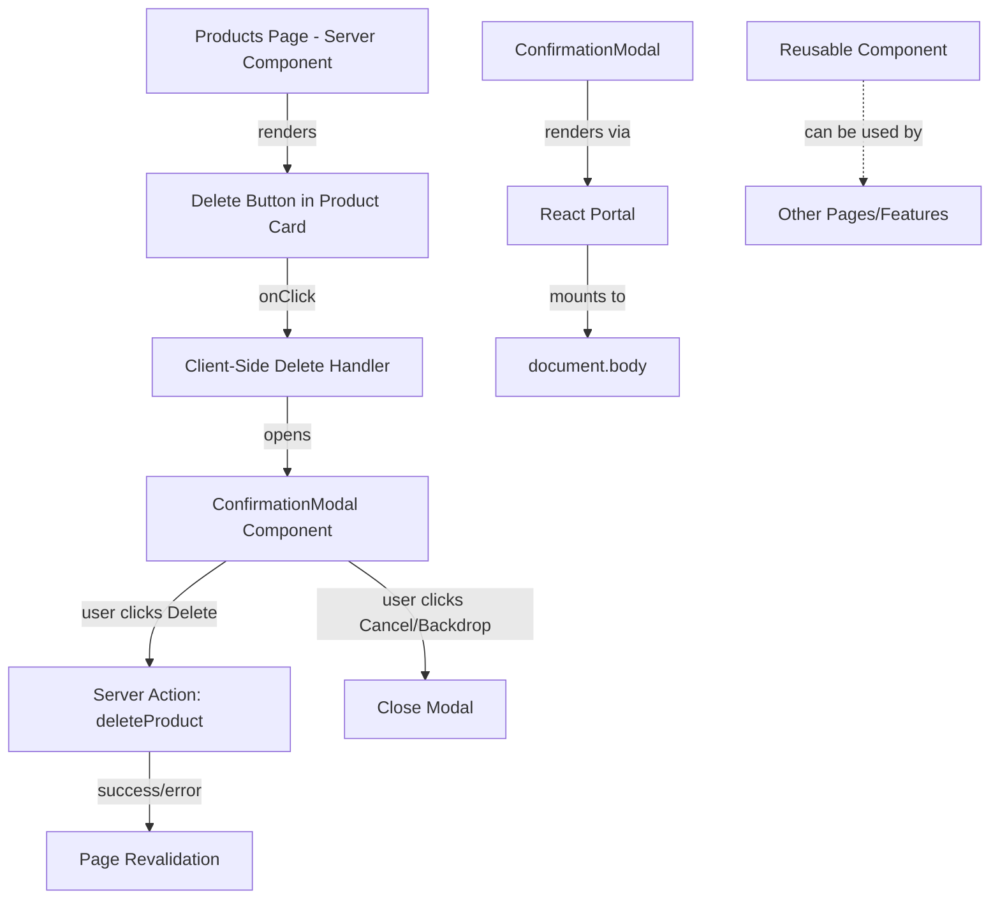
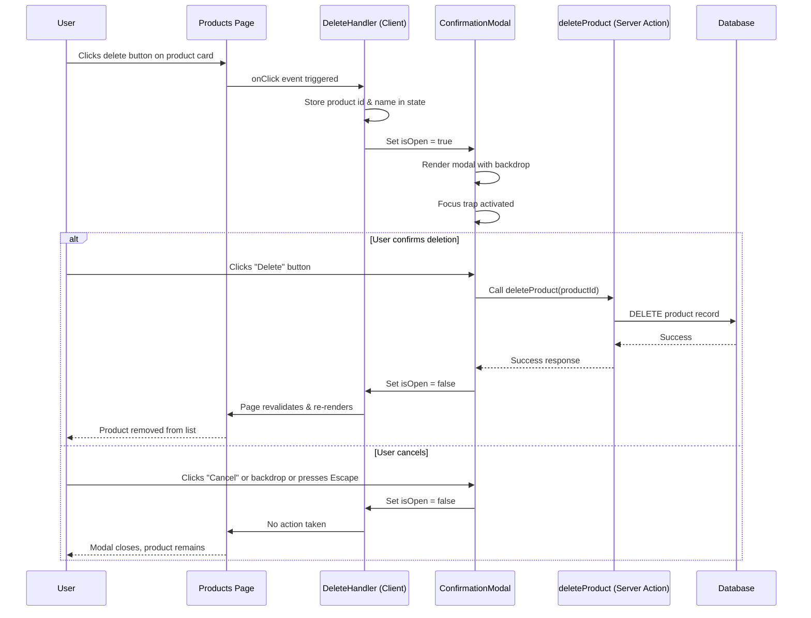
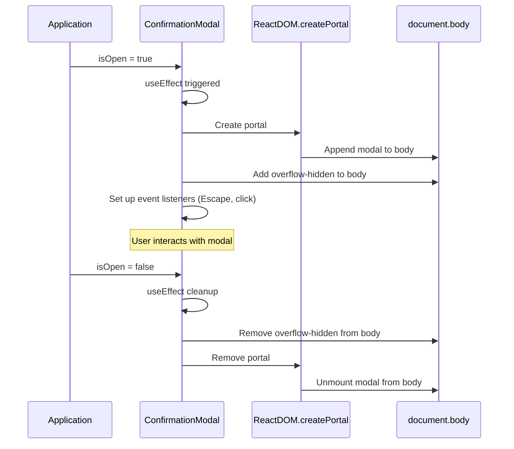
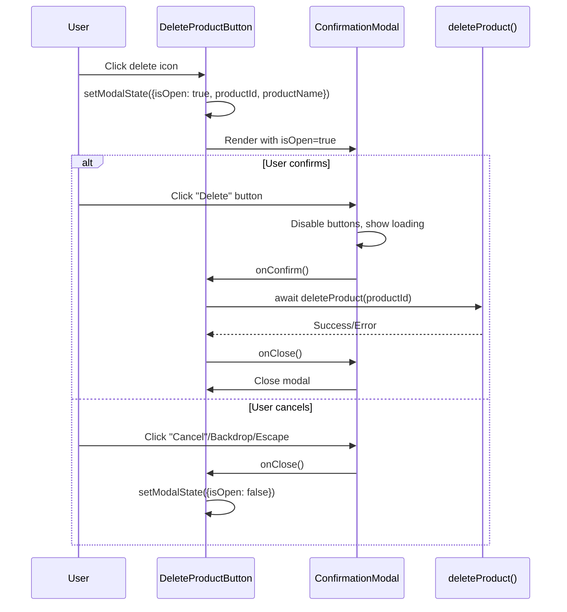

# Design Document: Product Deletion Confirmation Modal

## Overview

This feature replaces the native browser `confirm()` dialog with a custom, reusable confirmation modal component for product deletion in the vendor dashboard. The modal provides better UX with branded styling (emerald theme), displays the product name in the confirmation message, and requires explicit user action through "Cancel" and "Delete" buttons. The component is designed to be reusable across the application for other confirmation scenarios, preventing accidental deletions through a modal backdrop overlay and clear visual hierarchy.

The design follows React's composition patterns using client-side state management for modal visibility, portal-based rendering for proper z-index layering, and accessibility best practices including keyboard navigation (Escape key), focus trapping, and ARIA attributes.

## Architecture



## Sequence Diagrams

### Main Flow: Product Deletion with Confirmation



### Component Lifecycle



## Components and Interfaces

### Component 1: ConfirmationModal

**Purpose**: A reusable modal component that displays a confirmation dialog with customizable title, message, and action buttons. Handles backdrop clicks, keyboard events (Escape key), and renders using React Portal for proper z-index layering.

**Interface**:
```typescript
interface ConfirmationModalProps {
  isOpen: boolean;
  onClose: () => void;
  onConfirm: () => void | Promise<void>;
  title: string;
  message: string;
  confirmText?: string;
  cancelText?: string;
  isDangerous?: boolean;
  isLoading?: boolean;
}
```

**Responsibilities**:
- Render modal overlay with backdrop
- Handle user interactions (confirm, cancel, backdrop click, Escape key)
- Manage focus trapping when modal is open
- Prevent body scrolling when modal is open
- Display loading state during async operations
- Provide accessibility attributes (ARIA roles, labels)
- Support keyboard navigation

**Props Description**:
- `isOpen`: Controls modal visibility
- `onClose`: Callback invoked when modal should close (cancel, backdrop click, Escape)
- `onConfirm`: Callback invoked when user confirms action (can be async)
- `title`: Modal heading text
- `message`: Main confirmation message content
- `confirmText`: Custom text for confirm button (default: "Confirm")
- `cancelText`: Custom text for cancel button (default: "Cancel")
- `isDangerous`: When true, styles confirm button as danger/destructive (red)
- `isLoading`: When true, shows loading state and disables buttons

### Component 2: DeleteProductButton (Client Component)

**Purpose**: A client-side wrapper component that manages the delete product flow with confirmation modal. This component wraps the delete button in the product card and handles modal state.

**Interface**:
```typescript
interface DeleteProductButtonProps {
  productId: string;
  productName: string;
}
```

**Responsibilities**:
- Manage modal open/close state
- Store product information for confirmation message
- Handle form submission to server action
- Display loading state during deletion
- Handle error states and user feedback

### Component 3: Products Page (Modified)

**Purpose**: The main products listing page that displays product cards. Modified to use the new DeleteProductButton component instead of inline browser confirm().

**Modifications**:
- Replace inline form with delete button and browser confirm() with `<DeleteProductButton>` component
- Pass product id and name to the new component
- Maintain existing layout and styling

## Data Models

### Modal State

```typescript
interface ModalState {
  isOpen: boolean;
  productId: string | null;
  productName: string | null;
  isDeleting: boolean;
}
```

**Purpose**: Manages the state of the deletion confirmation flow in the DeleteProductButton component.

**Fields**:
- `isOpen`: Whether the confirmation modal is currently displayed
- `productId`: ID of the product to be deleted (null when modal is closed)
- `productName`: Name of the product to be deleted (null when modal is closed)
- `isDeleting`: Whether a deletion operation is in progress

### ConfirmationModal Component Props

```typescript
interface ConfirmationModalProps {
  isOpen: boolean;
  onClose: () => void;
  onConfirm: () => void | Promise<void>;
  title: string;
  message: string;
  confirmText?: string;
  cancelText?: string;
  isDangerous?: boolean;
  isLoading?: boolean;
}
```

**Validation Rules**:
- `isOpen` must be a boolean value
- `onClose` and `onConfirm` must be valid callback functions
- `title` and `message` must be non-empty strings
- `confirmText` and `cancelText` default to "Confirm" and "Cancel" if not provided
- `isDangerous` defaults to false
- `isLoading` defaults to false

## Main Algorithm/Workflow



## Key Functions with Formal Specifications

### Function 1: handleDeleteClick()

```typescript
function handleDeleteClick(productId: string, productName: string): void
```

**Preconditions:**
- `productId` is a non-empty valid string UUID
- `productName` is a non-empty string
- Component is mounted and interactive

**Postconditions:**
- Modal state is updated with `isOpen = true`
- `productId` and `productName` are stored in component state
- ConfirmationModal component is rendered
- User can see the confirmation modal on screen

**Loop Invariants:** N/A (no loops in function)

**Side Effects:**
- Updates React component state via `setModalState`
- Triggers React re-render to show modal

### Function 2: handleConfirmDelete()

```typescript
async function handleConfirmDelete(): Promise<void>
```

**Preconditions:**
- Modal is open (`isOpen === true`)
- `productId` is not null and is a valid UUID
- User has clicked the confirm button
- `deleteProduct` server action is available

**Postconditions:**
- If successful: Product is deleted from database, modal is closed, page revalidates
- If error: Error message is displayed, modal remains open
- Loading state is set to false
- Buttons are re-enabled

**Error Handling:**
- Catches exceptions from `deleteProduct` server action
- Displays error toast/message to user
- Maintains modal open state on error for retry

**Loop Invariants:** N/A (no loops in function)

**Side Effects:**
- Calls server action `deleteProduct`
- Modifies database (removes product record)
- Updates React component state
- May trigger page revalidation and re-render

### Function 3: handleModalClose()

```typescript
function handleModalClose(): void
```

**Preconditions:**
- Component is mounted
- Function is called by modal's onClose callback

**Postconditions:**
- Modal state is reset to initial values
- `isOpen` is set to false
- `productId` and `productName` are set to null
- `isDeleting` is set to false
- Modal is no longer visible to user

**Loop Invariants:** N/A (no loops in function)

**Side Effects:**
- Updates React component state via `setModalState`
- Triggers React re-render to hide modal
- Re-enables body scrolling (via modal component cleanup)

## Algorithmic Pseudocode

### Main Processing Algorithm: Delete Product Flow

```typescript
ALGORITHM handleProductDeletion(productId: string, productName: string)
INPUT: productId (string UUID), productName (string)
OUTPUT: void (side effect: product deleted or modal closed)

BEGIN
  ASSERT productId is non-empty AND productName is non-empty
  
  // Step 1: Open confirmation modal
  modalState ← {
    isOpen: true,
    productId: productId,
    productName: productName,
    isDeleting: false
  }
  setModalState(modalState)
  
  // Wait for user interaction
  AWAIT userDecision
  
  // Step 2: Handle user decision
  IF userDecision === "confirm" THEN
    // Update loading state
    setModalState({...modalState, isDeleting: true})
    
    TRY
      // Step 3: Execute server action
      result ← AWAIT deleteProduct(productId)
      
      ASSERT result indicates success OR result indicates failure
      
      IF result is successful THEN
        // Step 4: Close modal and allow revalidation
        setModalState({
          isOpen: false,
          productId: null,
          productName: null,
          isDeleting: false
        })
        
        // Page will automatically revalidate and re-render
        displaySuccessToast("Product deleted successfully")
      ELSE
        // Handle error case
        displayErrorToast("Failed to delete product")
        setModalState({...modalState, isDeleting: false})
      END IF
      
    CATCH error
      // Step 5: Handle exceptions
      console.error("Delete failed:", error)
      displayErrorToast("An error occurred while deleting")
      setModalState({...modalState, isDeleting: false})
    END TRY
    
  ELSE IF userDecision === "cancel" THEN
    // User cancelled - just close modal
    setModalState({
      isOpen: false,
      productId: null,
      productName: null,
      isDeleting: false
    })
  END IF
  
  ASSERT modalState.isOpen === false OR modalState.isDeleting === true
END
```

**Preconditions:**
- `productId` is a valid non-empty UUID string
- `productName` is a non-empty string
- React component is mounted
- `deleteProduct` server action is available
- User session is authenticated

**Postconditions:**
- If confirmed and successful: Product is removed from database and UI
- If confirmed and failed: Error message shown, modal remains open
- If cancelled: No changes, modal is closed
- Modal state is always in consistent state (not stuck in loading)

**Loop Invariants:** N/A (no loops, but state consistency maintained throughout)

### Modal Rendering Algorithm

```typescript
ALGORITHM renderConfirmationModal(props: ConfirmationModalProps)
INPUT: props containing isOpen, onClose, onConfirm, title, message, styling options
OUTPUT: React portal with modal UI or null

BEGIN
  // Early return if not open
  IF props.isOpen === false THEN
    RETURN null
  END IF
  
  // Step 1: Set up side effects
  useEffect(() => {
    // Prevent body scroll
    document.body.style.overflow = "hidden"
    
    // Set up keyboard listener
    handleKeyDown ← (event) => {
      IF event.key === "Escape" AND NOT props.isLoading THEN
        props.onClose()
      END IF
    }
    document.addEventListener("keydown", handleKeyDown)
    
    // Cleanup function
    RETURN () => {
      document.body.style.overflow = ""
      document.removeEventListener("keydown", handleKeyDown)
    }
  })
  
  // Step 2: Create modal JSX
  modalContent ← (
    <Backdrop onClick={props.onClose when not loading}>
      <ModalContainer onClick={stopPropagation}>
        <IconContainer>
          <WarningIcon color={props.isDangerous ? "red" : "amber"} />
        </IconContainer>
        
        <Title>{props.title}</Title>
        <Message>{props.message}</Message>
        
        <ButtonContainer>
          <CancelButton 
            onClick={props.onClose}
            disabled={props.isLoading}
          >
            {props.cancelText || "Cancel"}
          </CancelButton>
          
          <ConfirmButton
            onClick={props.onConfirm}
            disabled={props.isLoading}
            className={props.isDangerous ? "danger" : "primary"}
          >
            {props.isLoading ? <Spinner /> : (props.confirmText || "Confirm")}
          </ConfirmButton>
        </ButtonContainer>
      </ModalContainer>
    </Backdrop>
  )
  
  // Step 3: Render via portal
  RETURN createPortal(modalContent, document.body)
END
```

**Preconditions:**
- Component is mounted in browser environment
- `document.body` is available
- All required props are provided and valid

**Postconditions:**
- If `isOpen` is true: Modal is rendered as direct child of `document.body`
- If `isOpen` is false: Nothing is rendered (returns null)
- Body scroll is prevented when modal is open
- Escape key listener is active when modal is open
- All event listeners are cleaned up when modal closes or unmounts

**Loop Invariants:** N/A

## Example Usage

### Example 1: Basic Product Deletion

```typescript
// In DeleteProductButton component
'use client';

import { useState } from 'react';
import { ConfirmationModal } from '@/app/ui/confirmation-modal';
import { deleteProduct } from '@/app/lib/actions';
import { TrashIcon } from '@heroicons/react/24/outline';

export function DeleteProductButton({ productId, productName }: DeleteProductButtonProps) {
  const [modalState, setModalState] = useState({
    isOpen: false,
    isDeleting: false,
  });

  const handleDeleteClick = () => {
    setModalState({ isOpen: true, isDeleting: false });
  };

  const handleConfirmDelete = async () => {
    setModalState(prev => ({ ...prev, isDeleting: true }));
    
    try {
      await deleteProduct(productId);
      setModalState({ isOpen: false, isDeleting: false });
      // Page will revalidate automatically
    } catch (error) {
      console.error('Delete failed:', error);
      alert('Failed to delete product');
      setModalState(prev => ({ ...prev, isDeleting: false }));
    }
  };

  const handleClose = () => {
    setModalState({ isOpen: false, isDeleting: false });
  };

  return (
    <>
      <button
        type="button"
        onClick={handleDeleteClick}
        className="flex h-8 w-8 items-center justify-center rounded-lg border border-slate-200 text-slate-600 transition-colors hover:bg-red-50 hover:text-red-500 hover:border-red-100"
        title="Delete product"
      >
        <TrashIcon className="h-4 w-4" />
      </button>

      <ConfirmationModal
        isOpen={modalState.isOpen}
        onClose={handleClose}
        onConfirm={handleConfirmDelete}
        title="Delete Product"
        message={`Are you sure you want to delete "${productName}"? This action cannot be undone.`}
        confirmText="Delete"
        cancelText="Cancel"
        isDangerous={true}
        isLoading={modalState.isDeleting}
      />
    </>
  );
}
```

### Example 2: Reusing Modal for Other Confirmations

```typescript
// Example: Confirming discount deletion
export function DeleteDiscountButton({ discountId, discountCode }: Props) {
  const [isOpen, setIsOpen] = useState(false);
  const [isDeleting, setIsDeleting] = useState(false);

  return (
    <>
      <button onClick={() => setIsOpen(true)}>Delete Discount</button>
      
      <ConfirmationModal
        isOpen={isOpen}
        onClose={() => setIsOpen(false)}
        onConfirm={async () => {
          setIsDeleting(true);
          await deleteDiscount(discountId);
          setIsOpen(false);
          setIsDeleting(false);
        }}
        title="Delete Discount Code"
        message={`Remove discount code "${discountCode}"?`}
        confirmText="Remove"
        isDangerous={true}
        isLoading={isDeleting}
      />
    </>
  );
}
```

### Example 3: Non-Dangerous Confirmation

```typescript
// Example: Confirming status change (not destructive)
export function ToggleProductStatus({ productId, currentStatus }: Props) {
  const [isOpen, setIsOpen] = useState(false);

  return (
    <>
      <button onClick={() => setIsOpen(true)}>Change Status</button>
      
      <ConfirmationModal
        isOpen={isOpen}
        onClose={() => setIsOpen(false)}
        onConfirm={async () => {
          await updateProductStatus(productId, !currentStatus);
          setIsOpen(false);
        }}
        title="Change Product Status"
        message={`Change product to ${currentStatus ? 'inactive' : 'active'}?`}
        confirmText="Change Status"
        isDangerous={false}  // Not a destructive action
      />
    </>
  );
}
```

## Correctness Properties

### Property 1: Modal Visibility Consistency
```typescript
// For all states: if isOpen is true, modal must be rendered in DOM
∀ state: ModalState, (state.isOpen === true) ⟹ (document.querySelector('[role="dialog"]') !== null)

// If isOpen is false, modal must not be rendered
∀ state: ModalState, (state.isOpen === false) ⟹ (document.querySelector('[role="dialog"]') === null)
```

### Property 2: Button State During Loading
```typescript
// When deleting, both buttons must be disabled
∀ props: ConfirmationModalProps, (props.isLoading === true) ⟹ 
  (confirmButton.disabled === true ∧ cancelButton.disabled === true)

// User cannot close modal during loading (backdrop clicks ignored)
∀ props: ConfirmationModalProps, (props.isLoading === true) ⟹ 
  (backdropClick does not trigger onClose)
```

### Property 3: Product Information Accuracy
```typescript
// Confirmation message must contain correct product name
∀ productName: string, confirmationMessage.includes(productName) === true

// Product ID passed to deleteProduct must match the product user clicked
∀ productId: string, (handleDeleteClick(productId) eventually calls deleteProduct(productId))
```

### Property 4: Body Scroll Prevention
```typescript
// When modal is open, body scroll must be prevented
∀ modalOpen: boolean, (modalOpen === true) ⟹ 
  (document.body.style.overflow === "hidden")

// When modal closes, body scroll must be restored
∀ modalOpen: boolean, (modalOpen === false) ⟹ 
  (document.body.style.overflow === "" ∨ document.body.style.overflow === "auto")
```

### Property 5: Cleanup on Unmount
```typescript
// When component unmounts, all event listeners must be removed
∀ component: DeleteProductButton, onUnmount(component) ⟹ 
  (noEventListenersRemain() ∧ bodyScrollRestored())

// Modal state must be reset on unmount
∀ component: DeleteProductButton, onUnmount(component) ⟹ 
  (modalState.isOpen === false)
```

### Property 6: Error Handling Guarantees
```typescript
// If delete fails, modal must remain open for retry
∀ error: Error, (deleteProduct() throws error) ⟹ 
  (modalState.isOpen === true ∧ modalState.isDeleting === false)

// If delete succeeds, modal must close
∀ result: Success, (deleteProduct() returns result) ⟹ 
  eventually(modalState.isOpen === false)
```

### Property 7: Keyboard Accessibility
```typescript
// Escape key must close modal when not loading
∀ keyEvent: KeyboardEvent, 
  (keyEvent.key === "Escape" ∧ modalState.isDeleting === false) ⟹ 
  (modalState.isOpen becomes false)

// Escape key must be ignored during loading
∀ keyEvent: KeyboardEvent,
  (keyEvent.key === "Escape" ∧ modalState.isDeleting === true) ⟹ 
  (modalState.isOpen remains true)
```

## Error Handling

### Error Scenario 1: Server Action Failure

**Condition**: The `deleteProduct` server action throws an error or returns a failure response
**Response**: 
- Catch the error in `handleConfirmDelete`
- Log error to console for debugging
- Display user-friendly error message (toast notification or alert)
- Set `isDeleting` to false
- Keep modal open to allow retry

**Recovery**: 
- User can click "Delete" again to retry
- User can click "Cancel" to abort deletion
- Modal state remains consistent (not stuck in loading)

### Error Scenario 2: Invalid Product ID

**Condition**: `productId` is null, undefined, or empty string when attempting deletion
**Response**:
- Prevent `deleteProduct` call with guard clause
- Log warning to console
- Display error message: "Invalid product ID"
- Close modal immediately

**Recovery**:
- User is returned to products page
- No changes are made to database
- Page state remains consistent

### Error Scenario 3: Component Unmounts During Deletion

**Condition**: User navigates away or component unmounts while `deleteProduct` is in progress
**Response**:
- Use cleanup function to track if component is mounted
- Ignore state updates if component is unmounted
- Server action continues but UI updates are skipped

**Recovery**:
- Server action completes in background
- Product is deleted from database
- User sees updated state on next page visit
- No memory leaks or React warnings

### Error Scenario 4: Network Failure

**Condition**: Network request fails due to connectivity issues
**Response**:
- `deleteProduct` Promise rejects with network error
- Display error message: "Network error. Please check your connection."
- Set `isDeleting` to false
- Keep modal open

**Recovery**:
- User can retry when connection is restored
- Modal provides clear feedback about what went wrong

## Testing Strategy

### Unit Testing Approach

**ConfirmationModal Component Tests**:
- Test modal renders when `isOpen` is true
- Test modal does not render when `isOpen` is false
- Test `onConfirm` callback is invoked when confirm button is clicked
- Test `onClose` callback is invoked when cancel button is clicked
- Test `onClose` callback is invoked when backdrop is clicked
- Test `onClose` callback is invoked when Escape key is pressed
- Test backdrop click is ignored when `isLoading` is true
- Test Escape key is ignored when `isLoading` is true
- Test buttons are disabled when `isLoading` is true
- Test confirm button has danger styling when `isDangerous` is true
- Test loading spinner appears in confirm button when `isLoading` is true
- Test custom button text is displayed when provided
- Test default button text is used when not provided
- Test body overflow is set to hidden when modal opens
- Test body overflow is restored when modal closes
- Test event listeners are cleaned up on unmount

**DeleteProductButton Component Tests**:
- Test delete button renders with correct icon and styling
- Test clicking delete button opens modal
- Test modal displays correct product name in message
- Test confirming deletion calls `deleteProduct` with correct product ID
- Test successful deletion closes modal
- Test failed deletion keeps modal open and shows error
- Test cancelling deletion closes modal without calling `deleteProduct`
- Test loading state is displayed during deletion
- Test component handles unmounting during deletion gracefully

**Integration Tests**:
- Test complete delete flow from button click to product removal
- Test error handling with failed server action
- Test multiple products can be deleted in sequence
- Test modal state is isolated between different product cards

### Property-Based Testing Approach

**Property Test Library**: fast-check (TypeScript/JavaScript property-based testing)

**Property 1: Modal Visibility Idempotence**
```typescript
// Opening the modal multiple times should not cause issues
fc.assert(
  fc.property(fc.array(fc.boolean()), (openSequence) => {
    // Simulate multiple open/close operations
    // Modal should always end in consistent state
  })
);
```

**Property 2: Product Name Escaping**
```typescript
// Any product name (including special characters) should be safely displayed
fc.assert(
  fc.property(fc.string(), (productName) => {
    // Render modal with random product name
    // Check message contains product name and doesn't break rendering
    // Verify no XSS vulnerabilities
  })
);
```

**Property 3: State Consistency**
```typescript
// Modal state transitions should always be valid
fc.assert(
  fc.property(fc.commands(...), (commands) => {
    // Run sequence of user actions (open, close, confirm, etc.)
    // Verify state is always consistent
    // No invalid states (e.g., open=false but deleting=true)
  })
);
```

**Property 4: Event Listener Cleanup**
```typescript
// Mounting and unmounting should not leak event listeners
fc.assert(
  fc.property(fc.nat(100), (mountUnmountCount) => {
    // Mount and unmount component multiple times
    // Verify no event listeners remain after final unmount
  })
);
```

### Integration Testing Approach

**End-to-End Tests** (using Playwright or Cypress):
1. **Happy Path Test**:
   - Navigate to products page
   - Click delete button on a product
   - Verify modal appears with correct product name
   - Click "Delete" button
   - Verify modal closes
   - Verify product is removed from list

2. **Cancel Flow Test**:
   - Click delete button
   - Click "Cancel" in modal
   - Verify modal closes
   - Verify product remains in list

3. **Backdrop Click Test**:
   - Click delete button
   - Click modal backdrop
   - Verify modal closes
   - Verify product remains in list

4. **Escape Key Test**:
   - Click delete button
   - Press Escape key
   - Verify modal closes
   - Verify product remains in list

5. **Error Handling Test**:
   - Mock `deleteProduct` to fail
   - Click delete button and confirm
   - Verify error message appears
   - Verify modal remains open
   - Verify product is not removed

6. **Loading State Test**:
   - Mock slow `deleteProduct` (add delay)
   - Click delete button and confirm
   - Verify loading spinner appears
   - Verify buttons are disabled
   - Verify backdrop click is ignored during loading

## Performance Considerations

1. **React Portal Performance**:
   - Using `createPortal` ensures modal is rendered as direct child of `document.body`
   - Prevents unnecessary re-renders of parent components when modal state changes
   - Modal updates are isolated from products page re-renders

2. **Event Listener Optimization**:
   - Keyboard event listener is only attached when modal is open
   - Cleanup function removes listener when modal closes
   - Prevents memory leaks from accumulated event listeners

3. **Lazy State Updates**:
   - Modal state is local to `DeleteProductButton` component
   - No prop drilling or global state required
   - Minimal re-renders of sibling components

4. **Async Operation Handling**:
   - `deleteProduct` server action is properly awaited
   - Loading state prevents duplicate submissions
   - No race conditions from multiple clicks

## Security Considerations

1. **XSS Prevention**:
   - Product name is safely rendered in JSX (React auto-escapes)
   - No use of `dangerouslySetInnerHTML`
   - All user input is treated as text, not HTML

2. **Authorization**:
   - Server action `deleteProduct` must verify user owns the product
   - Client-side modal is UI only - security enforced server-side
   - Product ID validation occurs in server action

3. **CSRF Protection**:
   - Next.js Server Actions include built-in CSRF protection
   - No additional token handling required in modal

4. **Input Validation**:
   - Product ID is validated before server action call
   - Guard clauses prevent empty or invalid IDs
   - Error handling prevents exposing sensitive error details

## Dependencies

**Existing Dependencies** (already in project):
- React 18+ (for hooks, Portal API)
- Next.js 14+ (for Server Actions, server components)
- TypeScript (for type safety)
- Heroicons React (for icons)
- Tailwind CSS (for styling)

**New Dependencies**: None required

**Browser APIs Used**:
- `ReactDOM.createPortal` (for portal rendering)
- `document.body` (for portal mount point and scroll control)
- `document.addEventListener` (for keyboard events)
- `window` object (for browser environment checks)

**Server-Side Dependencies**:
- Existing `deleteProduct` server action from `@/app/lib/actions`
- Database access (handled by existing server action)
