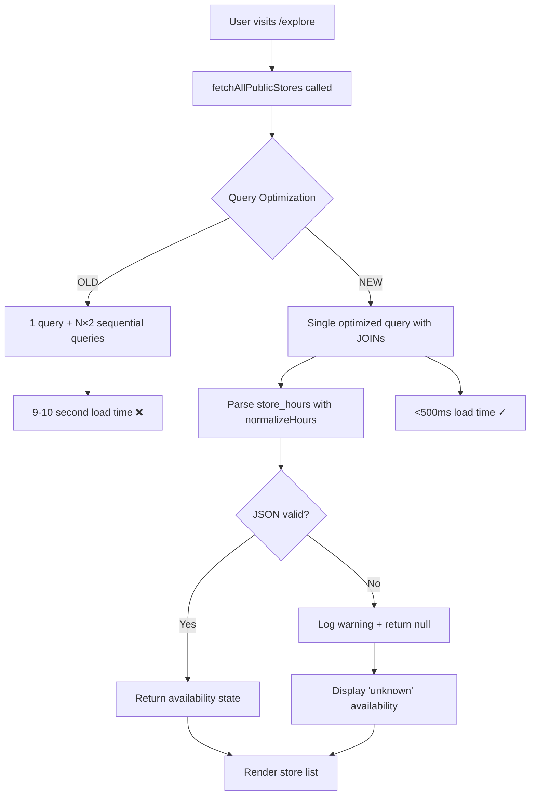

# Design Document: Store Performance and Data Fixes

## Overview

This design addresses three critical issues affecting the store exploration feature:

1. **Data Quality**: Malformed JSON in the `store_hours` column causing application crashes
2. **Performance**: N+1 query pattern in `fetchAllPublicStores()` causing 9-10 second page loads
3. **Resilience**: Insufficient error handling in `normalizeHours()` parser

The solution involves database data remediation, query optimization using SQL JOINs and aggregations, defensive error handling, and preventive database constraints. The target is to reduce query execution time from 9-10 seconds to under 500ms while ensuring the application never crashes due to malformed data.

**Key Objectives**:
- Eliminate N+1 query pattern by replacing sequential queries with optimized JOINs
- Add defensive error handling to all JSON parsing operations
- Create data migration script to clean malformed `store_hours` JSON
- Add database constraints to prevent future data quality issues
- Maintain backward compatibility with existing code

## Architecture

### Current Architecture Problems

**N+1 Query Pattern**:
```typescript
// Current fetchAllPublicStores() - BAD
for (const store of stores) {
  // Query 1 per store: fetch logo
  const logo = await sql`SELECT logo_url FROM store_theme WHERE vendor_id = ${store.id}`;
  
  // Query 2 per store: fetch top products
  const products = await sql`SELECT * FROM products WHERE vendor_id = ${store.id}`;
}
// Total: 1 + (N × 2) queries for N stores = 101 queries for 50 stores
```


**Unsafe JSON Parsing**:
```typescript
// Current normalizeHours() - CRASHES on bad data
if (typeof raw === 'string') {
  obj = JSON.parse(raw); // ❌ Throws on malformed JSON
}
```

### Target Architecture

**Optimized Single-Query Approach**:
```typescript
// Proposed fetchAllPublicStores() - GOOD
const stores = await sql`
  SELECT 
    u.*,
    st.logo_url,
    (
      SELECT json_agg(json_build_object(
        'name', p.name,
        'image_url', p.image_url,
        'price', p.price
      ))
      FROM (
        SELECT name, image_url, price
        FROM products
        WHERE vendor_id = u.id AND status = 'active'
        ORDER BY created_at DESC
        LIMIT 3
      ) p
    ) as top_products
  FROM users u
  LEFT JOIN store_theme st ON st.vendor_id = u.id
  WHERE u.store_name IS NOT NULL
    AND EXISTS (
      SELECT 1 FROM products p2
      WHERE p2.vendor_id = u.id AND p2.status = 'active'
    )
  GROUP BY u.id, st.logo_url
`;
// Total: 1 query for any number of stores
```


**Defensive JSON Parsing**:
```typescript
// Proposed normalizeHours() - SAFE
if (typeof raw === 'string') {
  try {
    obj = JSON.parse(raw);
  } catch (err) {
    console.error('Failed to parse store_hours JSON:', err);
    return null; // ✓ Returns null instead of crashing
  }
}
```

### System Flow




## Components and Interfaces

### 1. Query Optimization Component

**File**: `app/lib/data.ts`

**Function Signature**:
```typescript
export async function fetchAllPublicStores(
  search?: string,
  category?: string,
  sort?: string,
  location?: string,
  limit = 50,
): Promise<PublicStore[]>
```

**Changes**:
- Replace loop-based queries with single SQL query using LEFT JOINs
- Use PostgreSQL `json_agg()` and `json_build_object()` for nested product data
- Use subquery with `LIMIT 3` inside `json_agg()` for top products
- Maintain existing search, filter, and sort logic
- Remove individual `.catch()` handlers on per-store queries
- Add single try-catch around entire query

**Key SQL Pattern**:
```sql
SELECT 
  u.id, u.store_name, u.store_slug, u.store_description,
  u.category, u.location_state, u.store_timezone, u.store_hours,
  u.accepting_orders, u.store_closed_note,
  st.logo_url,
  COUNT(DISTINCT p_count.id)::text AS product_count,
  -- Aggregate top 3 products into JSON array
  (
    SELECT json_agg(json_build_object(
      'name', p.name,
      'image_url', p.image_url,
      'price', p.price
    ))
    FROM (
      SELECT name, image_url, price
      FROM products
      WHERE vendor_id = u.id AND status = 'active'
      ORDER BY created_at DESC
      LIMIT 3
    ) p
  ) as top_products
FROM users u
LEFT JOIN store_theme st ON st.vendor_id = u.id
LEFT JOIN products p_count ON p_count.vendor_id = u.id AND p_count.status = 'active'
WHERE u.store_name IS NOT NULL AND u.store_name != ''
GROUP BY u.id, u.store_name, u.store_slug, ..., st.logo_url
HAVING COUNT(p_count.id) > 0
```


### 2. Error Handling Component

**File**: `app/lib/store-availability.ts`

**Function Signature**:
```typescript
function normalizeHours(raw: unknown): StoreHoursJson | null
```

**Changes**:
- Wrap `JSON.parse()` in try-catch block
- Return `null` on parse failure instead of throwing
- Log parse errors with context (truncated raw value)
- Add input validation for `null` and `undefined` before parsing
- Maintain existing validation logic for parsed objects

**Error Handling Pattern**:
```typescript
function normalizeHours(raw: unknown): StoreHoursJson | null {
  if (raw == null) return null;
  
  let obj = raw;
  if (typeof raw === 'string') {
    try {
      obj = JSON.parse(raw);
    } catch (err) {
      console.error('Failed to parse store_hours JSON:', {
        error: err,
        rawPreview: String(raw).substring(0, 100) // Log first 100 chars
      });
      return null; // Safe fallback
    }
  }
  
  // Continue with existing validation logic...
}
```


### 3. Data Migration Component

**File**: `scripts/fix-store-hours-data.js`

**Purpose**: One-time script to clean malformed `store_hours` JSON in production database

**Script Structure**:
```javascript
const { sql } = require("./db-connection");

async function fixStoreHoursData(dryRun = true) {
  console.log(`🔍 ${dryRun ? 'DRY RUN' : 'LIVE RUN'} - Analyzing store_hours data...`);
  
  // 1. Find all stores with non-null store_hours
  const stores = await sql`
    SELECT id, store_name, store_hours 
    FROM users 
    WHERE store_hours IS NOT NULL
  `;
  
  let fixedCount = 0;
  let invalidCount = 0;
  const errors = [];
  
  // 2. Validate each store_hours value
  for (const store of stores) {
    try {
      // Try to parse as JSON
      if (typeof store.store_hours === 'string') {
        JSON.parse(store.store_hours);
      }
      // If we got here, it's valid
    } catch (err) {
      invalidCount++;
      errors.push({
        id: store.id,
        store_name: store.store_name,
        raw_value: store.store_hours,
        error: err.message
      });
      
      // 3. Fix by setting to NULL
      if (!dryRun) {
        await sql`
          UPDATE users 
          SET store_hours = NULL 
          WHERE id = ${store.id}
        `;
        fixedCount++;
      }
    }
  }
  
  // 4. Report results
  console.log(`\n📊 Results:`);
  console.log(`   Total stores checked: ${stores.length}`);
  console.log(`   Invalid store_hours: ${invalidCount}`);
  console.log(`   ${dryRun ? 'Would fix' : 'Fixed'}: ${dryRun ? invalidCount : fixedCount}`);
  
  if (errors.length > 0) {
    console.log(`\n❌ Invalid entries:`);
    errors.forEach(e => {
      console.log(`   - ${e.store_name} (${e.id}): ${e.error}`);
    });
  }
  
  return { total: stores.length, invalid: invalidCount, fixed: fixedCount };
}
```

