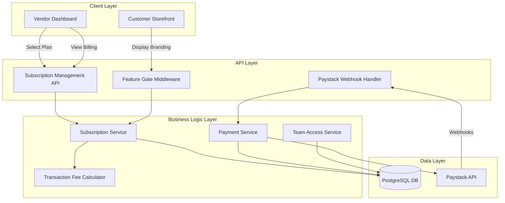
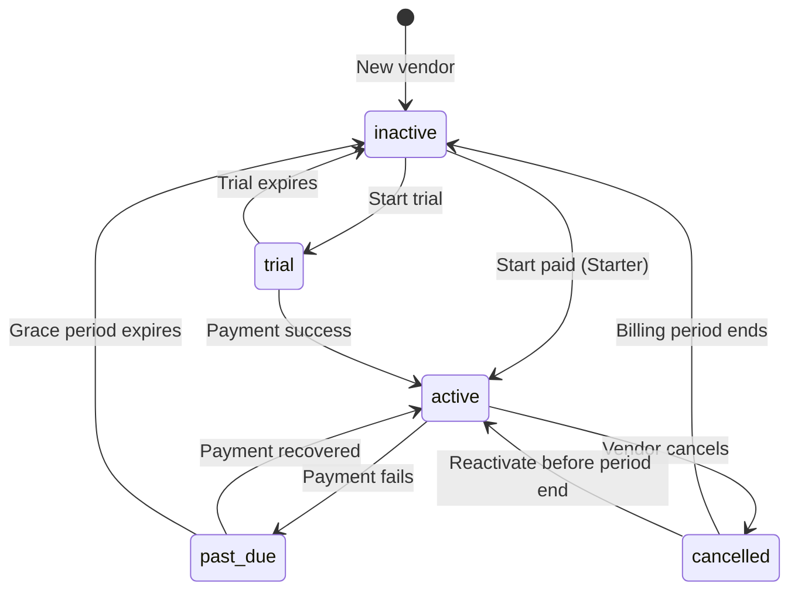
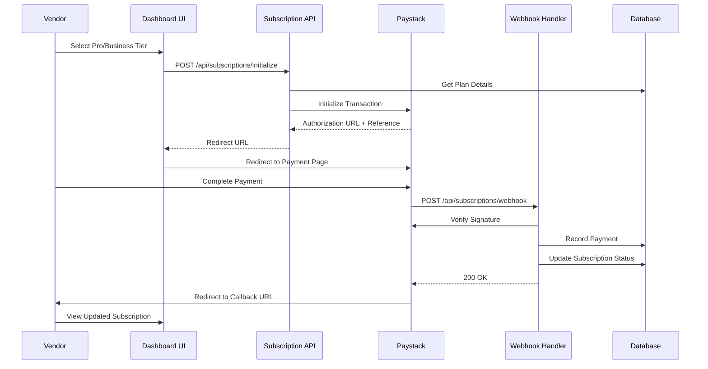

# Design Document

## Overview

This document specifies the technical design for a tiered subscription pricing system in the Vendle MVP. The system provides three subscription tiers (Starter, Pro, Business) with differentiated features, transaction fees, and access controls. The design integrates Paystack for recurring billing, implements feature gating middleware, enforces product limits, and provides team member access control for Business tier vendors.

### Key Design Goals

- **Seamless Payment Integration**: Leverage Paystack for secure recurring billing with webhook-based payment verification
- **Robust Feature Gating**: Implement middleware and utility functions to restrict feature access based on subscription tier
- **Scalable Architecture**: Design database schema and API endpoints to support future tier additions and feature expansions
- **Grace Period Management**: Provide vendors with breathing room during payment failures while protecting platform revenue
- **Transaction Fee Flexibility**: Calculate and apply tier-specific transaction fees to vendor payouts
- **Team Collaboration**: Enable Business tier vendors to delegate store management through team member accounts

## Architecture

### High-Level System Architecture



### Component Responsibilities

| Component | Responsibilities |
|-----------|------------------|
| **Subscription Management API** | Handle tier selection, upgrades, downgrades, cancellations |
| **Payment Service** | Process Paystack payments, verify webhooks, manage recurring billing |
| **Feature Gate Middleware** | Intercept requests and enforce feature access based on subscription tier |
| **Subscription Service** | Core business logic for subscription lifecycle management |
| **Team Access Service** | Manage team member invitations, permissions, and access control |
| **Transaction Fee Calculator** | Calculate tier-specific fees for order payouts |

## Components and Interfaces

### Database Schema

#### Enhanced `users` Table

```sql
-- Columns already added via ensureVendorSubscriptionSchema in data.ts
ALTER TABLE users ADD COLUMN IF NOT EXISTS subscription_status VARCHAR(20) NOT NULL DEFAULT 'inactive';
ALTER TABLE users ADD COLUMN IF NOT EXISTS subscription_expires_at TIMESTAMPTZ DEFAULT NULL;
ALTER TABLE users ADD COLUMN IF NOT EXISTS subscription_last_payment_reference VARCHAR(255) DEFAULT NULL;
ALTER TABLE users ADD COLUMN IF NOT EXISTS subscription_updated_at TIMESTAMPTZ NOT NULL DEFAULT CURRENT_TIMESTAMP;

-- New subscription tier column
ALTER TABLE users ADD COLUMN IF NOT EXISTS subscription_tier VARCHAR(20) NOT NULL DEFAULT 'starter';

-- Check constraint for valid subscription tiers
ALTER TABLE users ADD CONSTRAINT check_subscription_tier 
  CHECK (subscription_tier IN ('starter', 'pro', 'business'));

-- Check constraint for valid subscription statuses
ALTER TABLE users ADD CONSTRAINT check_subscription_status 
  CHECK (subscription_status IN ('active', 'trial', 'past_due', 'inactive', 'cancelled'));
```

#### New `subscription_plans` Table

```sql
CREATE TABLE subscription_plans (
  id UUID DEFAULT gen_random_uuid() PRIMARY KEY,
  tier VARCHAR(20) NOT NULL UNIQUE,
  name VARCHAR(50) NOT NULL,
  price_kobo INTEGER NOT NULL,
  transaction_fee_percentage DECIMAL(5,2) NOT NULL,
  product_limit INTEGER NOT NULL,
  features JSONB NOT NULL,
  created_at TIMESTAMPTZ DEFAULT CURRENT_TIMESTAMP,
  updated_at TIMESTAMPTZ DEFAULT CURRENT_TIMESTAMP
);

-- Seed initial plans
INSERT INTO subscription_plans (tier, name, price_kobo, transaction_fee_percentage, product_limit, features) VALUES
  ('starter', 'Starter', 0, 5.00, 10, '{"analytics": false, "team_members": false, "custom_domain": false, "priority_support": false, "theme_level": "basic"}'),
  ('pro', 'Pro', 150000, 3.00, 100, '{"analytics": true, "team_members": false, "custom_domain": false, "priority_support": true, "theme_level": "premium"}'),
  ('business', 'Business', 350000, 2.00, 1000, '{"analytics": true, "advanced_analytics": true, "team_members": true, "custom_domain": true, "priority_support": true, "theme_level": "exclusive"}');
```


#### Enhanced `vendor_subscription_payments` Table

```sql
-- Table already created in ensureVendorSubscriptionSchema
CREATE TABLE IF NOT EXISTS vendor_subscription_payments (
  id UUID DEFAULT gen_random_uuid() PRIMARY KEY,
  vendor_id UUID NOT NULL REFERENCES users(id) ON DELETE CASCADE,
  amount_kobo INTEGER NOT NULL,
  reference VARCHAR(255) NOT NULL,
  status VARCHAR(20) NOT NULL DEFAULT 'paid',
  paid_at TIMESTAMPTZ DEFAULT CURRENT_TIMESTAMP,
  created_at TIMESTAMPTZ DEFAULT CURRENT_TIMESTAMP,
  UNIQUE (vendor_id, reference)
);

-- Add additional columns for subscription tracking
ALTER TABLE vendor_subscription_payments ADD COLUMN IF NOT EXISTS tier VARCHAR(20) NOT NULL;
ALTER TABLE vendor_subscription_payments ADD COLUMN IF NOT EXISTS billing_period_start TIMESTAMPTZ NOT NULL;
ALTER TABLE vendor_subscription_payments ADD COLUMN IF NOT EXISTS billing_period_end TIMESTAMPTZ NOT NULL;
```

#### New `team_members` Table

```sql
CREATE TABLE team_members (
  id UUID DEFAULT gen_random_uuid() PRIMARY KEY,
  vendor_id UUID NOT NULL REFERENCES users(id) ON DELETE CASCADE,
  user_id UUID REFERENCES users(id) ON DELETE SET NULL,
  email VARCHAR(255) NOT NULL,
  role VARCHAR(20) NOT NULL DEFAULT 'assistant',
  permissions JSONB NOT NULL DEFAULT '{"products": true, "orders": true, "settings": false}',
  invited_by UUID NOT NULL REFERENCES users(id) ON DELETE CASCADE,
  invited_at TIMESTAMPTZ DEFAULT CURRENT_TIMESTAMP,
  accepted_at TIMESTAMPTZ DEFAULT NULL,
  status VARCHAR(20) NOT NULL DEFAULT 'pending',
  created_at TIMESTAMPTZ DEFAULT CURRENT_TIMESTAMP,
  updated_at TIMESTAMPTZ DEFAULT CURRENT_TIMESTAMP,
  
  CONSTRAINT check_team_role CHECK (role IN ('admin', 'assistant')),
  CONSTRAINT check_team_status CHECK (status IN ('pending', 'active', 'inactive')),
  UNIQUE(vendor_id, email)
);

CREATE INDEX idx_team_members_vendor ON team_members(vendor_id);
CREATE INDEX idx_team_members_user ON team_members(user_id);
```


#### New `subscription_invoices` Table

```sql
CREATE TABLE subscription_invoices (
  id UUID DEFAULT gen_random_uuid() PRIMARY KEY,
  vendor_id UUID NOT NULL REFERENCES users(id) ON DELETE CASCADE,
  payment_id UUID NOT NULL REFERENCES vendor_subscription_payments(id) ON DELETE CASCADE,
  invoice_number VARCHAR(50) NOT NULL UNIQUE,
  amount_kobo INTEGER NOT NULL,
  tier VARCHAR(20) NOT NULL,
  billing_period_start TIMESTAMPTZ NOT NULL,
  billing_period_end TIMESTAMPTZ NOT NULL,
  issued_at TIMESTAMPTZ DEFAULT CURRENT_TIMESTAMP,
  pdf_url VARCHAR(500),
  created_at TIMESTAMPTZ DEFAULT CURRENT_TIMESTAMP
);

CREATE INDEX idx_invoices_vendor ON subscription_invoices(vendor_id);
```

#### New `subscription_events` Table

```sql
CREATE TABLE subscription_events (
  id UUID DEFAULT gen_random_uuid() PRIMARY KEY,
  vendor_id UUID NOT NULL REFERENCES users(id) ON DELETE CASCADE,
  event_type VARCHAR(50) NOT NULL,
  from_tier VARCHAR(20),
  to_tier VARCHAR(20),
  metadata JSONB,
  created_at TIMESTAMPTZ DEFAULT CURRENT_TIMESTAMP
);

CREATE INDEX idx_subscription_events_vendor ON subscription_events(vendor_id);
CREATE INDEX idx_subscription_events_type ON subscription_events(event_type);

-- event_type values: 'tier_selected', 'upgrade', 'downgrade', 'payment_success', 
-- 'payment_failed', 'trial_started', 'trial_converted', 'cancelled', 'reactivated'
```

### TypeScript Interfaces and Types

```typescript
// app/lib/definitions.ts additions

export type SubscriptionTier = 'starter' | 'pro' | 'business';

export type SubscriptionStatus = 'active' | 'trial' | 'past_due' | 'inactive' | 'cancelled';

export type SubscriptionPlan = {
  id: string;
  tier: SubscriptionTier;
  name: string;
  price_kobo: number;
  transaction_fee_percentage: number;
  product_limit: number;
  features: SubscriptionFeatures;
  created_at: string;
  updated_at: string;
};
```


export type SubscriptionFeatures = {
  analytics: boolean;
  advanced_analytics?: boolean;
  team_members: boolean;
  custom_domain: boolean;
  priority_support: boolean;
  theme_level: 'basic' | 'premium' | 'exclusive';
};

export type SubscriptionPayment = {
  id: string;
  vendor_id: string;
  amount_kobo: number;
  reference: string;
  tier: SubscriptionTier;
  status: 'paid' | 'failed' | 'pending';
  billing_period_start: string;
  billing_period_end: string;
  paid_at: string;
  created_at: string;
};

export type TeamMemberPermissions = {
  products: boolean;
  orders: boolean;
  settings: boolean;
};

export type TeamMember = {
  id: string;
  vendor_id: string;
  user_id: string | null;
  email: string;
  role: 'admin' | 'assistant';
  permissions: TeamMemberPermissions;
  invited_by: string;
  invited_at: string;
  accepted_at: string | null;
  status: 'pending' | 'active' | 'inactive';
  created_at: string;
  updated_at: string;
};

export type SubscriptionInvoice = {
  id: string;
  vendor_id: string;
  payment_id: string;
  invoice_number: string;
  amount_kobo: number;
  tier: SubscriptionTier;
  billing_period_start: string;
  billing_period_end: string;
  issued_at: string;
  pdf_url: string | null;
  created_at: string;
};
```


export type SubscriptionEvent = {
  id: string;
  vendor_id: string;
  event_type: string;
  from_tier: SubscriptionTier | null;
  to_tier: SubscriptionTier | null;
  metadata: Record<string, any> | null;
  created_at: string;
};

export type VendorSubscriptionInfo = {
  tier: SubscriptionTier;
  status: SubscriptionStatus;
  expires_at: string | null;
  last_payment_reference: string | null;
  updated_at: string;
  plan: SubscriptionPlan;
  grace_days_remaining: number | null;
  is_trial: boolean;
  trial_days_remaining: number | null;
};
```

### Subscription Service Module

```typescript
// app/lib/subscriptions.ts

import { sql } from './db';
import { 
  SubscriptionTier, 
  SubscriptionStatus, 
  SubscriptionPlan,
  VendorSubscriptionInfo 
} from './definitions';

export async function ensureSubscriptionSchema() {
  // Create subscription_plans table if not exists
  await sql.unsafe(`
    CREATE TABLE IF NOT EXISTS subscription_plans (
      id UUID DEFAULT gen_random_uuid() PRIMARY KEY,
      tier VARCHAR(20) NOT NULL UNIQUE,
      name VARCHAR(50) NOT NULL,
      price_kobo INTEGER NOT NULL,
      transaction_fee_percentage DECIMAL(5,2) NOT NULL,
      product_limit INTEGER NOT NULL,
      features JSONB NOT NULL,
      created_at TIMESTAMPTZ DEFAULT CURRENT_TIMESTAMP,
      updated_at TIMESTAMPTZ DEFAULT CURRENT_TIMESTAMP
    )
  `);
  
  // Seed plans if empty
  const existingPlans = await sql`SELECT COUNT(*) FROM subscription_plans`;
  if (Number(existingPlans[0].count) === 0) {
    await seedSubscriptionPlans();
  }
```

  
  // Add subscription_tier column to users
  await sql.unsafe(`
    ALTER TABLE users ADD COLUMN IF NOT EXISTS subscription_tier VARCHAR(20) NOT NULL DEFAULT 'starter'
  `);
  
  // Add tier to vendor_subscription_payments
  await sql.unsafe(`
    ALTER TABLE vendor_subscription_payments ADD COLUMN IF NOT EXISTS tier VARCHAR(20)
  `);
  await sql.unsafe(`
    ALTER TABLE vendor_subscription_payments ADD COLUMN IF NOT EXISTS billing_period_start TIMESTAMPTZ
  `);
  await sql.unsafe(`
    ALTER TABLE vendor_subscription_payments ADD COLUMN IF NOT EXISTS billing_period_end TIMESTAMPTZ
  `);
  
  // Create team_members table
  await sql.unsafe(`
    CREATE TABLE IF NOT EXISTS team_members (
      id UUID DEFAULT gen_random_uuid() PRIMARY KEY,
      vendor_id UUID NOT NULL REFERENCES users(id) ON DELETE CASCADE,
      user_id UUID REFERENCES users(id) ON DELETE SET NULL,
      email VARCHAR(255) NOT NULL,
      role VARCHAR(20) NOT NULL DEFAULT 'assistant',
      permissions JSONB NOT NULL DEFAULT '{"products": true, "orders": true, "settings": false}',
      invited_by UUID NOT NULL REFERENCES users(id) ON DELETE CASCADE,
      invited_at TIMESTAMPTZ DEFAULT CURRENT_TIMESTAMP,
      accepted_at TIMESTAMPTZ DEFAULT NULL,
      status VARCHAR(20) NOT NULL DEFAULT 'pending',
      created_at TIMESTAMPTZ DEFAULT CURRENT_TIMESTAMP,
      updated_at TIMESTAMPTZ DEFAULT CURRENT_TIMESTAMP,
      UNIQUE(vendor_id, email)
    )
  `);
}

async function seedSubscriptionPlans() {
  await sql`
    INSERT INTO subscription_plans (tier, name, price_kobo, transaction_fee_percentage, product_limit, features)
    VALUES
      ('starter', 'Starter', 0, 5.00, 10, '{"analytics": false, "team_members": false, "custom_domain": false, "priority_support": false, "theme_level": "basic"}'),
      ('pro', 'Pro', 150000, 3.00, 100, '{"analytics": true, "team_members": false, "custom_domain": false, "priority_support": true, "theme_level": "premium"}'),
      ('business', 'Business', 350000, 2.00, 1000, '{"analytics": true, "advanced_analytics": true, "team_members": true, "custom_domain": true, "priority_support": true, "theme_level": "exclusive"}')
  `;
}
```


export async function getSubscriptionPlans(): Promise<SubscriptionPlan[]> {
  const plans = await sql<SubscriptionPlan[]>`
    SELECT * FROM subscription_plans ORDER BY price_kobo ASC
  `;
  return plans;
}

export async function getSubscriptionPlan(tier: SubscriptionTier): Promise<SubscriptionPlan | null> {
  const plans = await sql<SubscriptionPlan[]>`
    SELECT * FROM subscription_plans WHERE tier = ${tier} LIMIT 1
  `;
  return plans[0] || null;
}

export async function getVendorSubscription(vendorId: string): Promise<VendorSubscriptionInfo | null> {
  const users = await sql`
    SELECT 
      subscription_tier,
      subscription_status,
      subscription_expires_at,
      subscription_last_payment_reference,
      subscription_updated_at
    FROM users
    WHERE id = ${vendorId}
  `;
  
  if (!users[0]) return null;
  
  const user = users[0];
  const plan = await getSubscriptionPlan(user.subscription_tier as SubscriptionTier);
  
  if (!plan) return null;
  
  const now = new Date();
  const expiresAt = user.subscription_expires_at ? new Date(user.subscription_expires_at) : null;
  
  let graceDaysRemaining: number | null = null;
  if (user.subscription_status === 'past_due' && expiresAt) {
    const graceEndDate = new Date(expiresAt.getTime() + 7 * 24 * 60 * 60 * 1000);
    graceDaysRemaining = Math.max(0, Math.ceil((graceEndDate.getTime() - now.getTime()) / (24 * 60 * 60 * 1000)));
  }
  
  const isTrial = user.subscription_status === 'trial';
  let trialDaysRemaining: number | null = null;
  if (isTrial && expiresAt) {
    trialDaysRemaining = Math.max(0, Math.ceil((expiresAt.getTime() - now.getTime()) / (24 * 60 * 60 * 1000)));
  }
  
  return {
    tier: user.subscription_tier as SubscriptionTier,
    status: user.subscription_status as SubscriptionStatus,
    expires_at: user.subscription_expires_at,
    last_payment_reference: user.subscription_last_payment_reference,
    updated_at: user.subscription_updated_at,
    plan,
    grace_days_remaining: graceDaysRemaining,
    is_trial: isTrial,
    trial_days_remaining: trialDaysRemaining
  };
}
```


export async function hasFeatureAccess(
  vendorId: string, 
  feature: keyof SubscriptionFeatures
): Promise<boolean> {
  const subscription = await getVendorSubscription(vendorId);
  if (!subscription) return false;
  
  // Allow access during grace period
  if (subscription.status === 'past_due' && subscription.grace_days_remaining && subscription.grace_days_remaining > 0) {
    return subscription.plan.features[feature] === true;
  }
  
  // Allow access during active or trial status
  if (subscription.status === 'active' || subscription.status === 'trial') {
    return subscription.plan.features[feature] === true;
  }
  
  return false;
}

export async function getProductLimit(vendorId: string): Promise<number> {
  const subscription = await getVendorSubscription(vendorId);
  if (!subscription) return 10; // Default to starter limit
  
  return subscription.plan.product_limit;
}

export async function getTransactionFeePercentage(vendorId: string): Promise<number> {
  const subscription = await getVendorSubscription(vendorId);
  if (!subscription) return 5.0; // Default to starter fee
  
  return subscription.plan.transaction_fee_percentage;
}

export async function canCreateProduct(vendorId: string): Promise<{allowed: boolean; reason?: string}> {
  const [countResult] = await sql`
    SELECT COUNT(*) as count FROM products 
    WHERE vendor_id = ${vendorId} AND status = 'active'
  `;
  
  const currentCount = Number(countResult.count);
  const limit = await getProductLimit(vendorId);
  
  if (currentCount >= limit) {
    return {
      allowed: false,
      reason: `You've reached your product limit of ${limit}. Upgrade your plan to add more products.`
    };
  }
  
  return { allowed: true };
}
```


export async function updateSubscriptionTier(
  vendorId: string,
  newTier: SubscriptionTier,
  immediate: boolean = false
): Promise<void> {
  const currentSub = await getVendorSubscription(vendorId);
  
  if (!currentSub) {
    throw new Error('Subscription not found');
  }
  
  // Log the tier change event
  await sql`
    INSERT INTO subscription_events (vendor_id, event_type, from_tier, to_tier)
    VALUES (${vendorId}, 'tier_change', ${currentSub.tier}, ${newTier})
  `;
  
  if (immediate) {
    await sql`
      UPDATE users
      SET subscription_tier = ${newTier}, subscription_updated_at = CURRENT_TIMESTAMP
      WHERE id = ${vendorId}
    `;
  } else {
    // Store scheduled downgrade in metadata for cron job processing
    await sql`
      UPDATE users
      SET subscription_tier = ${newTier}, subscription_updated_at = CURRENT_TIMESTAMP
      WHERE id = ${vendorId}
    `;
  }
}

export async function recordSubscriptionPayment(
  vendorId: string,
  tier: SubscriptionTier,
  amountKobo: number,
  reference: string
): Promise<void> {
  const now = new Date();
  const billingPeriodEnd = new Date(now.getTime() + 30 * 24 * 60 * 60 * 1000);
  
  await sql`
    INSERT INTO vendor_subscription_payments 
      (vendor_id, amount_kobo, reference, tier, status, billing_period_start, billing_period_end, paid_at)
    VALUES 
      (${vendorId}, ${amountKobo}, ${reference}, ${tier}, 'paid', ${now.toISOString()}, ${billingPeriodEnd.toISOString()}, CURRENT_TIMESTAMP)
  `;
  
  await sql`
    UPDATE users
    SET 
      subscription_tier = ${tier},
      subscription_status = 'active',
      subscription_expires_at = ${billingPeriodEnd.toISOString()},
      subscription_last_payment_reference = ${reference},
      subscription_updated_at = CURRENT_TIMESTAMP
    WHERE id = ${vendorId}
  `;
  
  // Log payment success event
  await sql`
    INSERT INTO subscription_events (vendor_id, event_type, to_tier, metadata)
    VALUES (${vendorId}, 'payment_success', ${tier}, ${JSON.stringify({ reference, amount_kobo: amountKobo })})
  `;
}
```


export async function handlePaymentFailure(vendorId: string): Promise<void> {
  await sql`
    UPDATE users
    SET subscription_status = 'past_due', subscription_updated_at = CURRENT_TIMESTAMP
    WHERE id = ${vendorId}
  `;
  
  // Log payment failure event
  await sql`
    INSERT INTO subscription_events (vendor_id, event_type)
    VALUES (${vendorId}, 'payment_failed')
  `;
}

export async function startTrial(
  vendorId: string,
  tier: SubscriptionTier,
  trialDays: number = 14
): Promise<void> {
  const trialEnd = new Date(Date.now() + trialDays * 24 * 60 * 60 * 1000);
  
  await sql`
    UPDATE users
    SET 
      subscription_tier = ${tier},
      subscription_status = 'trial',
      subscription_expires_at = ${trialEnd.toISOString()},
      subscription_updated_at = CURRENT_TIMESTAMP
    WHERE id = ${vendorId}
  `;
  
  await sql`
    INSERT INTO subscription_events (vendor_id, event_type, to_tier)
    VALUES (${vendorId}, 'trial_started', ${tier})
  `;
}

export async function cancelSubscription(vendorId: string): Promise<void> {
  await sql`
    UPDATE users
    SET subscription_status = 'cancelled', subscription_updated_at = CURRENT_TIMESTAMP
    WHERE id = ${vendorId}
  `;
  
  await sql`
    INSERT INTO subscription_events (vendor_id, event_type)
    VALUES (${vendorId}, 'cancelled')
  `;
}
```

### Paystack Integration Service

```typescript
// app/lib/paystack-subscriptions.ts

import { 
  verifyPaymentDetails, 
  PaystackVerifyDetails 
} from './paystack';

export interface SubscriptionPaymentRequest {
  vendorId: string;
  tier: 'pro' | 'business';
  email: string;
  callbackUrl: string;
}
```


export async function initializeSubscriptionPayment(
  request: SubscriptionPaymentRequest
): Promise<{ ok: boolean; authorization_url?: string; reference?: string; error?: string }> {
  const secretKey = process.env.PAYSTACK_SECRET_KEY;
  
  if (!secretKey) {
    return { ok: false, error: 'Paystack not configured' };
  }
  
  // Get plan price
  const plan = await getSubscriptionPlan(request.tier);
  if (!plan) {
    return { ok: false, error: 'Invalid subscription tier' };
  }
  
  const reference = `SUB-${request.vendorId.slice(0, 8)}-${Date.now()}`;
  
  try {
    const response = await fetch('https://api.paystack.co/transaction/initialize', {
      method: 'POST',
      headers: {
        Authorization: `Bearer ${secretKey}`,
        'Content-Type': 'application/json',
      },
      body: JSON.stringify({
        email: request.email,
        amount: plan.price_kobo,
        reference,
        callback_url: request.callbackUrl,
        metadata: {
          vendorId: request.vendorId,
          tier: request.tier,
          type: 'subscription'
        }
      }),
    });
    
    const data = await response.json();
    
    if (!response.ok || !data.status) {
      return { ok: false, error: data.message || 'Payment initialization failed' };
    }
    
    return {
      ok: true,
      authorization_url: data.data.authorization_url,
      reference: data.data.reference
    };
  } catch (error: any) {
    return { ok: false, error: error.message || 'Payment initialization error' };
  }
}

export async function verifySubscriptionPayment(
  reference: string
): Promise<{ ok: boolean; vendorId?: string; tier?: string; error?: string }> {
  const result = await verifyPaymentDetails(reference);
  
  if (!result.ok) {
    return { ok: false, error: result.error };
  }
  
  const metadata = result.metadata || {};
  
  if (metadata.type !== 'subscription') {
    return { ok: false, error: 'Not a subscription payment' };
  }
  
  return {
    ok: true,
    vendorId: metadata.vendorId,
    tier: metadata.tier
  };
}
```


### Feature Gate Middleware

```typescript
// app/lib/feature-gate.ts

import { getServerSession } from 'next-auth';
import { authOptions } from '@/app/api/auth/[...nextauth]/route';
import { hasFeatureAccess, getVendorSubscription } from './subscriptions';
import { SubscriptionFeatures } from './definitions';

export async function requireFeature(feature: keyof SubscriptionFeatures) {
  const session = await getServerSession(authOptions);
  
  if (!session?.user?.id) {
    throw new Error('Unauthorized');
  }
  
  const hasAccess = await hasFeatureAccess(session.user.id, feature);
  
  if (!hasAccess) {
    const subscription = await getVendorSubscription(session.user.id);
    throw new Error(
      `This feature requires ${feature === 'analytics' ? 'Pro or Business' : 'Business'} tier. ` +
      `You are currently on ${subscription?.plan.name || 'Starter'} plan.`
    );
  }
}

export async function withFeatureGate<T>(
  feature: keyof SubscriptionFeatures,
  handler: () => Promise<T>
): Promise<T> {
  await requireFeature(feature);
  return handler();
}

export type FeatureGateResult<T> = 
  | { ok: true; data: T }
  | { ok: false; error: string; requiresUpgrade: boolean; currentTier: string };

export async function featureGatedAction<T>(
  feature: keyof SubscriptionFeatures,
  handler: () => Promise<T>
): Promise<FeatureGateResult<T>> {
  const session = await getServerSession(authOptions);
  
  if (!session?.user?.id) {
    return { ok: false, error: 'Unauthorized', requiresUpgrade: false, currentTier: 'none' };
  }
  
  const hasAccess = await hasFeatureAccess(session.user.id, feature);
  const subscription = await getVendorSubscription(session.user.id);
  
  if (!hasAccess) {
    return {
      ok: false,
      error: `This feature requires ${feature === 'analytics' ? 'Pro or Business' : 'Business'} tier`,
      requiresUpgrade: true,
      currentTier: subscription?.tier || 'starter'
    };
  }
  
  try {
    const data = await handler();
    return { ok: true, data };
  } catch (error: any) {
    return { 
      ok: false, 
      error: error.message || 'Action failed', 
      requiresUpgrade: false,
      currentTier: subscription?.tier || 'starter'
    };
  }
}
```


### Transaction Fee Calculator

```typescript
// app/lib/transaction-fees.ts

import { getTransactionFeePercentage } from './subscriptions';

export async function calculateTransactionFee(
  vendorId: string,
  orderAmount: number
): Promise<{ fee: number; feePercentage: number; netAmount: number }> {
  const feePercentage = await getTransactionFeePercentage(vendorId);
  const fee = Math.round(orderAmount * (feePercentage / 100));
  const netAmount = orderAmount - fee;
  
  return {
    fee,
    feePercentage,
    netAmount
  };
}

export async function calculatePayoutAmount(
  vendorId: string,
  orderAmount: number
): Promise<number> {
  const { netAmount } = await calculateTransactionFee(vendorId, orderAmount);
  return netAmount;
}

export async function getTransactionFeeBreakdown(vendorId: string, orderIds: string[]) {
  const feePercentage = await getTransactionFeePercentage(vendorId);
  
  const orders = await sql`
    SELECT id, total_amount FROM orders 
    WHERE id = ANY(${orderIds}) AND vendor_id = ${vendorId} AND status = 'fulfilled'
  `;
  
  const breakdown = orders.map(order => {
    const fee = Math.round(order.total_amount * (feePercentage / 100));
    return {
      orderId: order.id,
      orderAmount: order.total_amount,
      fee,
      netAmount: order.total_amount - fee
    };
  });
  
  const totalOrderAmount = breakdown.reduce((sum, item) => sum + item.orderAmount, 0);
  const totalFee = breakdown.reduce((sum, item) => sum + item.fee, 0);
  const totalNetAmount = breakdown.reduce((sum, item) => sum + item.netAmount, 0);
  
  return {
    feePercentage,
    breakdown,
    totals: {
      orderAmount: totalOrderAmount,
      fee: totalFee,
      netAmount: totalNetAmount
    }
  };
}
```


### Team Member Management Service

```typescript
// app/lib/team-management.ts

import { sql } from './db';
import { TeamMember, TeamMemberPermissions } from './definitions';
import { hasFeatureAccess } from './subscriptions';

export async function canManageTeam(vendorId: string): Promise<boolean> {
  return hasFeatureAccess(vendorId, 'team_members');
}

export async function getTeamMembers(vendorId: string): Promise<TeamMember[]> {
  const members = await sql<TeamMember[]>`
    SELECT * FROM team_members
    WHERE vendor_id = ${vendorId}
    ORDER BY created_at DESC
  `;
  return members;
}

export async function getTeamMemberCount(vendorId: string): Promise<number> {
  const [result] = await sql`
    SELECT COUNT(*) as count FROM team_members
    WHERE vendor_id = ${vendorId} AND status IN ('pending', 'active')
  `;
  return Number(result.count);
}

export async function inviteTeamMember(
  vendorId: string,
  email: string,
  role: 'admin' | 'assistant',
  permissions: TeamMemberPermissions,
  invitedBy: string
): Promise<{ ok: boolean; member?: TeamMember; error?: string }> {
  // Check if vendor has team feature access
  const hasAccess = await canManageTeam(vendorId);
  if (!hasAccess) {
    return { ok: false, error: 'Team management requires Business tier' };
  }
  
  // Check team member limit (5 for Business tier)
  const currentCount = await getTeamMemberCount(vendorId);
  if (currentCount >= 5) {
    return { ok: false, error: 'Team member limit reached (5 members maximum)' };
  }
  
  // Check if email already invited
  const existing = await sql`
    SELECT id FROM team_members
    WHERE vendor_id = ${vendorId} AND email = ${email}
  `;
  
  if (existing.length > 0) {
    return { ok: false, error: 'This email has already been invited' };
  }
  
  try {
    const [member] = await sql<TeamMember[]>`
      INSERT INTO team_members (vendor_id, email, role, permissions, invited_by)
      VALUES (${vendorId}, ${email}, ${role}, ${JSON.stringify(permissions)}, ${invitedBy})
      RETURNING *
    `;
    
    // TODO: Send invitation email
    
    return { ok: true, member };
  } catch (error: any) {
    return { ok: false, error: error.message || 'Failed to invite team member' };
  }
}
```


export async function acceptTeamInvitation(
  invitationId: string,
  userId: string
): Promise<{ ok: boolean; error?: string }> {
  try {
    await sql`
      UPDATE team_members
      SET user_id = ${userId}, status = 'active', accepted_at = CURRENT_TIMESTAMP
      WHERE id = ${invitationId} AND status = 'pending'
    `;
    return { ok: true };
  } catch (error: any) {
    return { ok: false, error: error.message || 'Failed to accept invitation' };
  }
}

export async function removeTeamMember(
  vendorId: string,
  memberId: string
): Promise<{ ok: boolean; error?: string }> {
  try {
    await sql`
      DELETE FROM team_members
      WHERE id = ${memberId} AND vendor_id = ${vendorId}
    `;
    return { ok: true };
  } catch (error: any) {
    return { ok: false, error: error.message || 'Failed to remove team member' };
  }
}

export async function updateTeamMemberPermissions(
  vendorId: string,
  memberId: string,
  permissions: TeamMemberPermissions
): Promise<{ ok: boolean; error?: string }> {
  try {
    await sql`
      UPDATE team_members
      SET permissions = ${JSON.stringify(permissions)}, updated_at = CURRENT_TIMESTAMP
      WHERE id = ${memberId} AND vendor_id = ${vendorId}
    `;
    return { ok: true };
  } catch (error: any) {
    return { ok: false, error: error.message || 'Failed to update permissions' };
  }
}

export async function deactivateAllTeamMembers(vendorId: string): Promise<void> {
  await sql`
    UPDATE team_members
    SET status = 'inactive', updated_at = CURRENT_TIMESTAMP
    WHERE vendor_id = ${vendorId}
  `;
}

export async function hasTeamPermission(
  userId: string,
  vendorId: string,
  permission: keyof TeamMemberPermissions
): Promise<boolean> {
  const [member] = await sql`
    SELECT permissions FROM team_members
    WHERE user_id = ${userId} AND vendor_id = ${vendorId} AND status = 'active'
  `;
  
  if (!member) return false;
  
  const perms = member.permissions as TeamMemberPermissions;
  return perms[permission] === true;
}
```


### Branding Watermark Component

```typescript
// app/ui/store/branding-watermark.tsx

import { getVendorSubscription } from '@/app/lib/subscriptions';

export async function BrandingWatermark({ vendorId }: { vendorId: string }) {
  const subscription = await getVendorSubscription(vendorId);
  
  // Only show for starter tier
  if (!subscription || subscription.tier !== 'starter') {
    return null;
  }
  
  return (
    <div className="mt-8 py-4 border-t border-gray-200 text-center">
      <a 
        href="https://vendle.co" 
        target="_blank" 
        rel="noopener noreferrer"
        className="inline-flex items-center gap-2 text-sm text-gray-500 hover:text-gray-700 transition-colors"
      >
        <span>Powered by</span>
        <span className="font-semibold text-gray-700">Vendle</span>
      </a>
    </div>
  );
}
```

## Data Models

### Subscription State Machine



### Subscription Tier Features Matrix

| Feature | Starter | Pro | Business |
|---------|---------|-----|----------|
| Product Limit | 10 | 100 | 1000 |
| Transaction Fee | 5% | 3% | 2% |
| Analytics Dashboard | ❌ | ✅ | ✅ |
| Advanced Analytics | ❌ | ❌ | ✅ |
| Team Members | ❌ | ❌ | ✅ (5 max) |
| Custom Domain | ❌ | ❌ | ✅ |
| Priority Support | ❌ | ✅ | ✅ |
| Theme Level | Basic | Premium | Exclusive |
| Branding Watermark | ✅ | ❌ | ❌ |


### Subscription Payment Flow



## Error Handling

### Payment Failure Scenarios

| Scenario | System Response | User Experience |
|----------|----------------|-----------------|
| Payment initialization fails | Return error to user | Show error message, retry option |
| Payment verification fails | Log failure, notify admin | Show generic error, contact support |
| Webhook signature invalid | Reject webhook, log security event | No user-facing change |
| Payment declined by bank | Update status to past_due | Email notification, grace period starts |
| Recurring payment fails | Trigger grace period logic | Email alert, dashboard banner |
| Grace period expires | Downgrade to Starter | Email notification, feature restrictions apply |

### Feature Gate Error Messages

```typescript
export const FEATURE_GATE_ERRORS = {
  analytics: {
    title: 'Analytics Unavailable',
    message: 'Analytics dashboard requires Pro or Business tier.',
    action: 'Upgrade to Pro'
  },
  advanced_analytics: {
    title: 'Advanced Analytics Unavailable',
    message: 'Advanced analytics features require Business tier.',
    action: 'Upgrade to Business'
  },
  team_members: {
    title: 'Team Management Unavailable',
    message: 'Team member management requires Business tier.',
    action: 'Upgrade to Business'
  },
  custom_domain: {
    title: 'Custom Domain Unavailable',
    message: 'Custom domain configuration requires Business tier.',
    action: 'Upgrade to Business'
  }
};
```


### Webhook Security

```typescript
// app/api/subscriptions/webhook/route.ts

import crypto from 'crypto';

export function verifyPaystackWebhook(
  payload: string,
  signature: string
): boolean {
  const secretKey = process.env.PAYSTACK_SECRET_KEY;
  if (!secretKey) return false;
  
  const hash = crypto
    .createHmac('sha512', secretKey)
    .update(payload)
    .digest('hex');
  
  return hash === signature;
}

export async function POST(request: Request) {
  try {
    const payload = await request.text();
    const signature = request.headers.get('x-paystack-signature');
    
    if (!signature || !verifyPaystackWebhook(payload, signature)) {
      console.error('Invalid webhook signature');
      return Response.json({ error: 'Invalid signature' }, { status: 401 });
    }
    
    const event = JSON.parse(payload);
    
    // Process webhook based on event type
    switch (event.event) {
      case 'charge.success':
        await handleChargeSuccess(event.data);
        break;
      case 'subscription.disable':
        await handleSubscriptionDisabled(event.data);
        break;
      default:
        console.log('Unhandled webhook event:', event.event);
    }
    
    return Response.json({ received: true });
  } catch (error) {
    console.error('Webhook processing error:', error);
    return Response.json({ error: 'Processing failed' }, { status: 500 });
  }
}
```

## Testing Strategy

This feature uses **example-based unit tests** and **integration tests** for verification, as it primarily involves external service integration (Paystack), database transactions, and configuration-based feature gating rather than universal algorithmic properties.

### Unit Testing Approach

**Focus Areas:**
- Transaction fee calculation with specific tier percentages
- Feature access determination based on subscription status and tier
- Team member permission validation
- Subscription status transitions
- Product limit enforcement


**Example Test Cases:**

```typescript
// app/lib/transaction-fees.test.ts

describe('Transaction Fee Calculator', () => {
  it('calculates 5% fee for Starter tier', async () => {
    const result = await calculateTransactionFee('starter-vendor-id', 10000);
    expect(result.fee).toBe(500);
    expect(result.feePercentage).toBe(5.0);
    expect(result.netAmount).toBe(9500);
  });
  
  it('calculates 3% fee for Pro tier', async () => {
    const result = await calculateTransactionFee('pro-vendor-id', 10000);
    expect(result.fee).toBe(300);
    expect(result.feePercentage).toBe(3.0);
    expect(result.netAmount).toBe(9700);
  });
  
  it('calculates 2% fee for Business tier', async () => {
    const result = await calculateTransactionFee('business-vendor-id', 10000);
    expect(result.fee).toBe(200);
    expect(result.feePercentage).toBe(2.0);
    expect(result.netAmount).toBe(9800);
  });
});

// app/lib/feature-gate.test.ts

describe('Feature Gate', () => {
  it('blocks analytics for Starter tier', async () => {
    const hasAccess = await hasFeatureAccess('starter-vendor-id', 'analytics');
    expect(hasAccess).toBe(false);
  });
  
  it('allows analytics for Pro tier with active status', async () => {
    const hasAccess = await hasFeatureAccess('pro-vendor-id', 'analytics');
    expect(hasAccess).toBe(true);
  });
  
  it('blocks team_members for Pro tier', async () => {
    const hasAccess = await hasFeatureAccess('pro-vendor-id', 'team_members');
    expect(hasAccess).toBe(false);
  });
  
  it('allows team_members for Business tier', async () => {
    const hasAccess = await hasFeatureAccess('business-vendor-id', 'team_members');
    expect(hasAccess).toBe(true);
  });
  
  it('maintains access during grace period', async () => {
    // Vendor with past_due status but within 7-day grace period
    const hasAccess = await hasFeatureAccess('past-due-vendor-id', 'analytics');
    expect(hasAccess).toBe(true);
  });
  
  it('blocks access after grace period expires', async () => {
    // Vendor with past_due status beyond 7-day grace period
    const hasAccess = await hasFeatureAccess('expired-grace-vendor-id', 'analytics');
    expect(hasAccess).toBe(false);
  });
});
```


// app/lib/subscriptions.test.ts

describe('Product Limit Enforcement', () => {
  it('allows product creation below Starter limit', async () => {
    const result = await canCreateProduct('starter-vendor-with-5-products');
    expect(result.allowed).toBe(true);
  });
  
  it('blocks product creation at Starter limit', async () => {
    const result = await canCreateProduct('starter-vendor-with-10-products');
    expect(result.allowed).toBe(false);
    expect(result.reason).toContain('reached your product limit of 10');
  });
  
  it('allows product creation below Pro limit', async () => {
    const result = await canCreateProduct('pro-vendor-with-50-products');
    expect(result.allowed).toBe(true);
  });
});

// app/lib/team-management.test.ts

describe('Team Member Management', () => {
  it('blocks team invitation for Starter tier', async () => {
    const result = await inviteTeamMember(
      'starter-vendor-id',
      'member@example.com',
      'assistant',
      { products: true, orders: true, settings: false },
      'owner-id'
    );
    expect(result.ok).toBe(false);
    expect(result.error).toContain('Business tier');
  });
  
  it('allows team invitation for Business tier', async () => {
    const result = await inviteTeamMember(
      'business-vendor-id',
      'member@example.com',
      'assistant',
      { products: true, orders: true, settings: false },
      'owner-id'
    );
    expect(result.ok).toBe(true);
    expect(result.member).toBeDefined();
  });
  
  it('enforces 5 team member limit', async () => {
    const result = await inviteTeamMember(
      'business-vendor-with-5-members',
      'sixth@example.com',
      'assistant',
      { products: true, orders: true, settings: false },
      'owner-id'
    );
    expect(result.ok).toBe(false);
    expect(result.error).toContain('limit reached');
  });
  
  it('prevents duplicate email invitations', async () => {
    const result = await inviteTeamMember(
      'business-vendor-id',
      'existing@example.com',
      'assistant',
      { products: true, orders: true, settings: false },
      'owner-id'
    );
    expect(result.ok).toBe(false);
    expect(result.error).toContain('already been invited');
  });
});
```


### Integration Testing

**Paystack Integration Tests:**
- Mock Paystack API responses for payment initialization
- Verify webhook signature validation with test secret keys
- Test payment verification with successful and failed transactions
- Validate subscription payment metadata extraction

**Database Integration Tests:**
- Test subscription status transitions with concurrent updates
- Verify foreign key constraints on team member deletion
- Test cascading deletes when vendor account is removed
- Validate subscription event logging across multiple operations

**End-to-End Workflow Tests:**
1. New vendor onboarding → Default to Starter tier
2. Upgrade to Pro → Payment → Status update → Feature access granted
3. Payment failure → Grace period → Access maintained → Grace expiry → Downgrade
4. Trial activation → Trial expiry without payment → Downgrade
5. Cancellation → Scheduled downgrade → Period end → Tier change

### Manual Testing Checklist

- [ ] Subscription plan selection UI displays all tiers with features
- [ ] Payment flow redirects to Paystack and returns successfully
- [ ] Webhook processing updates subscription status correctly
- [ ] Feature gate blocks access with appropriate error messages
- [ ] Branding watermark appears only on Starter tier storefronts
- [ ] Product creation enforces tier-specific limits
- [ ] Transaction fee percentages apply correctly to payouts
- [ ] Team member invitations work for Business tier only
- [ ] Grace period notifications display in dashboard
- [ ] Trial countdown displays correctly
- [ ] Subscription cancellation maintains access until period end
- [ ] Downgrade scheduling prevents immediate feature loss

## API Endpoints

### Subscription Management Endpoints

#### GET /api/subscriptions/plans

Returns all available subscription plans with features and pricing.

**Response:**
```json
{
  "plans": [
    {
      "tier": "starter",
      "name": "Starter",
      "price_kobo": 0,
      "transaction_fee_percentage": 5.0,
      "product_limit": 10,
      "features": {
        "analytics": false,
        "team_members": false,
        "custom_domain": false,
        "priority_support": false,
        "theme_level": "basic"
      }
    },
    ...
  ]
}
```


#### GET /api/subscriptions/current

Returns current vendor's subscription information.

**Response:**
```json
{
  "tier": "pro",
  "status": "active",
  "expires_at": "2024-03-15T10:30:00Z",
  "plan": {
    "name": "Pro",
    "price_kobo": 150000,
    "transaction_fee_percentage": 3.0,
    "product_limit": 100
  },
  "is_trial": false,
  "grace_days_remaining": null
}
```

#### POST /api/subscriptions/initialize

Initializes a payment for subscription upgrade or purchase.

**Request:**
```json
{
  "tier": "pro",
  "callbackUrl": "https://vendle.co/dashboard/billing?status=success"
}
```

**Response:**
```json
{
  "ok": true,
  "authorization_url": "https://checkout.paystack.com/...",
  "reference": "SUB-abc12345-1234567890"
}
```

#### POST /api/subscriptions/verify

Verifies a subscription payment after redirect from Paystack.

**Request:**
```json
{
  "reference": "SUB-abc12345-1234567890"
}
```

**Response:**
```json
{
  "ok": true,
  "tier": "pro",
  "status": "active",
  "expires_at": "2024-03-15T10:30:00Z"
}
```

#### POST /api/subscriptions/cancel

Cancels the current subscription (maintains access until period end).

**Response:**
```json
{
  "ok": true,
  "status": "cancelled",
  "access_until": "2024-03-15T10:30:00Z"
}
```

#### POST /api/subscriptions/trial

Starts a trial period for Pro or Business tier.

**Request:**
```json
{
  "tier": "pro"
}
```

**Response:**
```json
{
  "ok": true,
  "status": "trial",
  "tier": "pro",
  "expires_at": "2024-03-01T10:30:00Z",
  "trial_days": 14
}
```


#### POST /api/subscriptions/webhook

Receives Paystack webhook events for payment processing.

**Request Headers:**
```
x-paystack-signature: <webhook signature>
```

**Request Body:**
```json
{
  "event": "charge.success",
  "data": {
    "reference": "SUB-abc12345-1234567890",
    "amount": 150000,
    "metadata": {
      "vendorId": "...",
      "tier": "pro",
      "type": "subscription"
    }
  }
}
```

**Response:**
```json
{
  "received": true
}
```

### Team Member Endpoints

#### GET /api/team

Returns all team members for the current vendor.

**Response:**
```json
{
  "members": [
    {
      "id": "...",
      "email": "member@example.com",
      "role": "assistant",
      "status": "active",
      "permissions": {
        "products": true,
        "orders": true,
        "settings": false
      },
      "invited_at": "2024-02-15T10:30:00Z",
      "accepted_at": "2024-02-16T08:20:00Z"
    }
  ],
  "limit": 5,
  "count": 1
}
```

#### POST /api/team/invite

Invites a new team member (Business tier only).

**Request:**
```json
{
  "email": "member@example.com",
  "role": "assistant",
  "permissions": {
    "products": true,
    "orders": true,
    "settings": false
  }
}
```

**Response:**
```json
{
  "ok": true,
  "member": {
    "id": "...",
    "email": "member@example.com",
    "status": "pending"
  }
}
```

#### POST /api/team/accept

Accepts a team member invitation.

**Request:**
```json
{
  "invitationId": "..."
}
```

**Response:**
```json
{
  "ok": true
}
```


#### DELETE /api/team/:memberId

Removes a team member.

**Response:**
```json
{
  "ok": true
}
```

#### PATCH /api/team/:memberId/permissions

Updates team member permissions.

**Request:**
```json
{
  "permissions": {
    "products": true,
    "orders": false,
    "settings": false
  }
}
```

**Response:**
```json
{
  "ok": true
}
```

### Analytics Endpoints

#### GET /api/analytics/dashboard

Returns analytics dashboard data (Pro/Business tier only).

**Response:**
```json
{
  "ok": true,
  "data": {
    "visits": 1250,
    "orders": 45,
    "revenue": 125000,
    "conversion_rate": 3.6
  }
}
```

#### GET /api/analytics/advanced

Returns advanced analytics (Business tier only).

**Response:**
```json
{
  "ok": true,
  "data": {
    "customer_lifetime_value": 25000,
    "repeat_customer_rate": 28.5,
    "product_performance": [
      {
        "product_id": "...",
        "name": "Product A",
        "sales": 125,
        "revenue": 50000
      }
    ]
  }
}
```

## Custom Domain Configuration

### DNS Requirements

For Business tier vendors to configure custom domains, the following DNS records must be set:

**CNAME Record:**
```
subdomain.example.com → stores.vendle.co
```

**Validation Process:**

1. Vendor enters desired custom domain in dashboard
2. System provides DNS configuration instructions
3. Vendor updates DNS records with their provider
4. System periodically checks DNS propagation
5. Once verified, system provisions SSL certificate via Let's Encrypt
6. Custom domain becomes active alongside default subdomain


### Custom Domain Service

```typescript
// app/lib/custom-domains.ts

import { sql } from './db';
import { hasFeatureAccess } from './subscriptions';

export type DomainStatus = 'pending' | 'validating' | 'active' | 'failed';

export type CustomDomain = {
  id: string;
  vendor_id: string;
  domain: string;
  status: DomainStatus;
  validation_error: string | null;
  ssl_provisioned: boolean;
  created_at: string;
  verified_at: string | null;
};

export async function canUseCustomDomain(vendorId: string): Promise<boolean> {
  return hasFeatureAccess(vendorId, 'custom_domain');
}

export async function addCustomDomain(
  vendorId: string,
  domain: string
): Promise<{ ok: boolean; domain?: CustomDomain; error?: string }> {
  const hasAccess = await canUseCustomDomain(vendorId);
  if (!hasAccess) {
    return { ok: false, error: 'Custom domains require Business tier' };
  }
  
  // Validate domain format
  const domainRegex = /^[a-z0-9]+([\-\.]{1}[a-z0-9]+)*\.[a-z]{2,}$/i;
  if (!domainRegex.test(domain)) {
    return { ok: false, error: 'Invalid domain format' };
  }
  
  // Check if domain already exists
  const existing = await sql`
    SELECT id FROM custom_domains WHERE domain = ${domain}
  `;
  
  if (existing.length > 0) {
    return { ok: false, error: 'This domain is already registered' };
  }
  
  try {
    const [customDomain] = await sql<CustomDomain[]>`
      INSERT INTO custom_domains (vendor_id, domain, status)
      VALUES (${vendorId}, ${domain}, 'pending')
      RETURNING *
    `;
    
    // Trigger DNS validation job
    await triggerDomainValidation(customDomain.id);
    
    return { ok: true, domain: customDomain };
  } catch (error: any) {
    return { ok: false, error: error.message || 'Failed to add custom domain' };
  }
}

export async function validateDomainDNS(domainId: string): Promise<boolean> {
  const [domain] = await sql<CustomDomain[]>`
    SELECT * FROM custom_domains WHERE id = ${domainId}
  `;
  
  if (!domain) return false;
  
  try {
    // Check CNAME record points to stores.vendle.co
    const dns = require('dns').promises;
    const records = await dns.resolveCname(domain.domain);
    
    if (records.includes('stores.vendle.co')) {
      await sql`
        UPDATE custom_domains
        SET status = 'validating', verified_at = CURRENT_TIMESTAMP
        WHERE id = ${domainId}
      `;
      
      // Trigger SSL provisioning
      await provisionSSL(domainId);
      return true;
    }
    
    return false;
  } catch (error) {
    await sql`
      UPDATE custom_domains
      SET status = 'failed', validation_error = ${String(error)}
      WHERE id = ${domainId}
    `;
    return false;
  }
}
```


## Background Jobs and Cron Tasks

### Subscription Expiry Check

**Frequency:** Daily at 00:00 UTC

**Purpose:** Identify and downgrade expired subscriptions

```typescript
// scripts/check-subscription-expiry.ts

export async function checkSubscriptionExpiry() {
  const now = new Date();
  
  // Find subscriptions past their expiry date with cancelled or inactive status
  const expiredSubscriptions = await sql`
    SELECT id, subscription_tier FROM users
    WHERE subscription_expires_at < ${now.toISOString()}
      AND subscription_status IN ('cancelled', 'inactive')
      AND subscription_tier != 'starter'
  `;
  
  for (const user of expiredSubscriptions) {
    await updateSubscriptionTier(user.id, 'starter', true);
    
    // Deactivate team members if downgrading from Business
    if (user.subscription_tier === 'business') {
      await deactivateAllTeamMembers(user.id);
    }
    
    console.log(`Downgraded user ${user.id} to Starter tier`);
  }
}
```

### Grace Period Expiry Check

**Frequency:** Daily at 01:00 UTC

**Purpose:** Downgrade vendors whose grace period has expired

```typescript
// scripts/check-grace-period-expiry.ts

export async function checkGracePeriodExpiry() {
  const now = new Date();
  const graceEndDate = new Date(now.getTime() - 7 * 24 * 60 * 60 * 1000);
  
  const expiredGracePeriods = await sql`
    SELECT id FROM users
    WHERE subscription_status = 'past_due'
      AND subscription_expires_at < ${graceEndDate.toISOString()}
  `;
  
  for (const user of expiredGracePeriods) {
    await updateSubscriptionTier(user.id, 'starter', true);
    await sql`
      UPDATE users
      SET subscription_status = 'inactive'
      WHERE id = ${user.id}
    `;
    
    // Send notification email
    console.log(`Grace period expired for user ${user.id}`);
  }
}
```

### Trial Expiry Notification

**Frequency:** Daily at 08:00 UTC

**Purpose:** Send notifications to vendors with expiring trials

```typescript
// scripts/notify-trial-expiry.ts

export async function notifyTrialExpiry() {
  const now = new Date();
  const oneDayFromNow = new Date(now.getTime() + 24 * 60 * 60 * 1000);
  const sevenDaysFromNow = new Date(now.getTime() + 7 * 24 * 60 * 60 * 1000);
  
  // 1-day warning
  const oneDayWarnings = await sql`
    SELECT id, email, subscription_tier FROM users
    WHERE subscription_status = 'trial'
      AND subscription_expires_at BETWEEN ${now.toISOString()} AND ${oneDayFromNow.toISOString()}
  `;
  
  // 7-day warning
  const sevenDayWarnings = await sql`
    SELECT id, email, subscription_tier FROM users
    WHERE subscription_status = 'trial'
      AND subscription_expires_at BETWEEN ${now.toISOString()} AND ${sevenDaysFromNow.toISOString()}
  `;
  
  // Send emails (implementation depends on email service)
  for (const user of [...oneDayWarnings, ...sevenDayWarnings]) {
    // sendTrialExpiryEmail(user.email, daysRemaining);
    console.log(`Trial expiry notification sent to ${user.email}`);
  }
}
```
