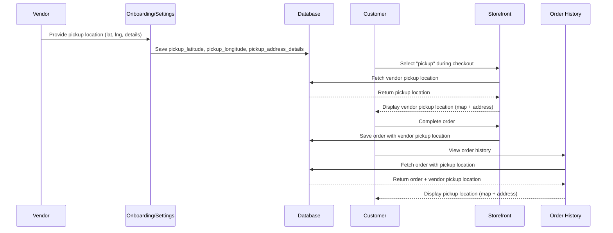

# Design Document: Vendor Pickup Location

## Overview

The Vendor Pickup Location feature enables vendors to offer pickup as a delivery option by storing their pickup location and displaying it to customers during checkout and in order history. Vendors capture their pickup location during onboarding if they offer pickup, can edit it in settings, and the location is saved with each pickup order for display in customer order history.

## Main Algorithm/Workflow



## Core Interfaces/Types

```typescript
// Extended User type with pickup location fields
interface User {
  // ... existing fields
  pickup_latitude: number | null;
  pickup_longitude: number | null;
  pickup_address_details: string | null;
  offers_pickup: boolean | null; // Whether vendor offers pickup option
}

// Extended Order type with vendor pickup location fields
interface Order {
  // ... existing fields
  delivery_type: 'pickup' | 'delivery';
  // Existing customer delivery location (for delivery orders)
  delivery_latitude: number | null;
  delivery_longitude: number | null;
  delivery_address_details: string | null;
  // NEW: Vendor pickup location (for pickup orders)
  vendor_pickup_latitude: number | null;
  vendor_pickup_longitude: number | null;
  vendor_pickup_address_details: string | null;
}

// Location picker input/output
interface Location {
  lat: number;
  lng: number;
  details?: string;
}
```

## Key Functions with Formal Specifications

### Function 1: saveVendorPickupLocation()

```typescript
async function saveVendorPickupLocation(
  vendorId: string,
  location: Location
): Promise<{ success: boolean; error?: string }>
```

**Preconditions:**
- `vendorId` is a valid UUID string
- `location.lat` is between -90 and 90 (valid latitude)
- `location.lng` is between -180 and 180 (valid longitude)
- `location.details` is optional string with max 500 characters

**Postconditions:**
- If successful: Returns `{ success: true }` and vendor's pickup location is updated in database
- If validation fails: Returns `{ success: false, error: descriptive message }`
- If database error: Returns `{ success: false, error: 'Database update failed' }`
- No side effects if any precondition fails

**Loop Invariants:** N/A (no loops)

### Function 2: fetchVendorPickupLocation()

```typescript
async function fetchVendorPickupLocation(
  vendorId: string
): Promise<Location | null>
```

**Preconditions:**
- `vendorId` is a valid UUID string
- Database connection is available

**Postconditions:**
- Returns `Location` object if vendor has pickup location stored
- Returns `null` if vendor has no pickup location or `offers_pickup` is false
- No mutations to database state

**Loop Invariants:** N/A (no loops)

### Function 3: saveOrderWithPickupLocation()

```typescript
async function saveOrderWithPickupLocation(
  orderId: string,
  vendorPickupLocation: Location
): Promise<{ success: boolean; error?: string }>
```

**Preconditions:**
- `orderId` is a valid UUID string
- `vendorPickupLocation` is non-null with valid lat/lng
- Order exists in database with `delivery_type === 'pickup'`

**Postconditions:**
- If successful: Returns `{ success: true }` and order has vendor pickup location saved
- If order not found or delivery_type not 'pickup': Returns `{ success: false, error: message }`
- No mutations if validation fails

**Loop Invariants:** N/A (no loops)

### Function 4: validatePickupLocation()

```typescript
function validatePickupLocation(
  location: Location | null
): { valid: boolean; error?: string }
```

**Preconditions:**
- `location` parameter is provided (may be null)

**Postconditions:**
- Returns `{ valid: false, error: 'Location is required' }` if location is null
- Returns `{ valid: false, error: 'Invalid latitude' }` if lat not in [-90, 90]
- Returns `{ valid: false, error: 'Invalid longitude' }` if lng not in [-180, 180]
- Returns `{ valid: false, error: 'Address details too long' }` if details > 500 chars
- Returns `{ valid: true }` if all validations pass
- No side effects on input parameter

**Loop Invariants:** N/A (no loops)

## Algorithmic Pseudocode

### Main Onboarding Pickup Location Capture Algorithm

```typescript
async function handleOnboardingPickupLocation(
  vendorId: string,
  offersPickup: boolean,
  pickupLocation: Location | null
): Promise<{ success: boolean; error?: string }> {
  // ASSERT: vendorId is valid UUID
  
  // Step 1: Check if vendor offers pickup
  if (!offersPickup) {
    // Clear any existing pickup location
    await clearVendorPickupLocation(vendorId);
    return { success: true };
  }
  
  // Step 2: Validate pickup location
  const validation = validatePickupLocation(pickupLocation);
  if (!validation.valid) {
    return { success: false, error: validation.error };
  }
  
  // Step 3: Save pickup location to database
  const result = await saveVendorPickupLocation(vendorId, pickupLocation!);
  
  // ASSERT: result indicates success or failure with error message
  
  return result;
}
```

**Preconditions:**
- vendorId is a valid UUID
- If offersPickup is true, pickupLocation must be provided
- Database connection is available

**Postconditions:**
- If offersPickup is false, vendor's pickup location is cleared
- If offersPickup is true and location is valid, pickup location is saved
- Returns success status with error message if validation fails

**Loop Invariants:** N/A (no loops in main flow)

### Settings Page Pickup Location Update Algorithm

```typescript
async function handleSettingsPickupUpdate(
  vendorId: string,
  currentOffersPickup: boolean,
  newOffersPickup: boolean,
  pickupLocation: Location | null
): Promise<{ success: boolean; error?: string }> {
  // Step 1: Check if offers_pickup changed from true to false
  if (currentOffersPickup && !newOffersPickup) {
    // Clear pickup location
    await clearVendorPickupLocation(vendorId);
    return { success: true };
  }
  
  // Step 2: If offers_pickup is true, validate and save location
  if (newOffersPickup) {
    const validation = validatePickupLocation(pickupLocation);
    if (!validation.valid) {
      return { success: false, error: validation.error };
    }
    
    const result = await saveVendorPickupLocation(vendorId, pickupLocation!);
    return result;
  }
  
  // Step 3: No change needed
  return { success: true };
}
```

**Preconditions:**
- vendorId is a valid UUID
- currentOffersPickup reflects vendor's current database state
- If newOffersPickup is true, pickupLocation must be provided

**Postconditions:**
- Vendor's pickup location state matches newOffersPickup setting
- If newOffersPickup is false, pickup location is cleared from database
- If newOffersPickup is true, pickup location is saved with validation

**Loop Invariants:** N/A

### Checkout Display Pickup Location Algorithm

```typescript
async function displayPickupLocationAtCheckout(
  vendorId: string,
  deliveryType: 'pickup' | 'delivery'
): Promise<Location | null> {
  // Step 1: Check delivery type
  if (deliveryType !== 'pickup') {
    return null; // Don't fetch pickup location for delivery orders
  }
  
  // Step 2: Fetch vendor pickup location
  const pickupLocation = await fetchVendorPickupLocation(vendorId);
  
  // ASSERT: pickupLocation is either valid Location object or null
  
  // Step 3: Return location for display
  return pickupLocation;
}
```

**Preconditions:**
- vendorId is a valid UUID
- deliveryType is either 'pickup' or 'delivery'

**Postconditions:**
- Returns vendor's pickup location if deliveryType is 'pickup' and location exists
- Returns null if deliveryType is 'delivery' or vendor has no pickup location
- No mutations to database

**Loop Invariants:** N/A

### Order History Pickup Location Display Algorithm

```typescript
async function getOrderPickupLocation(
  orderId: string
): Promise<Location | null> {
  // Step 1: Fetch order from database
  const order = await fetchOrderById(orderId);
  
  if (!order) {
    return null;
  }
  
  // Step 2: Check if order is pickup type
  if (order.delivery_type !== 'pickup') {
    return null;
  }
  
  // Step 3: Extract vendor pickup location from order
  if (
    order.vendor_pickup_latitude !== null &&
    order.vendor_pickup_longitude !== null
  ) {
    return {
      lat: order.vendor_pickup_latitude,
      lng: order.vendor_pickup_longitude,
      details: order.vendor_pickup_address_details || undefined,
    };
  }
  
  return null;
}
```

**Preconditions:**
- orderId is a valid UUID string
- Database connection is available

**Postconditions:**
- Returns Location object if order is pickup type and has vendor pickup location
- Returns null if order not found, is delivery type, or has no pickup location
- No database mutations

**Loop Invariants:** N/A

## Example Usage

```typescript
// Example 1: Onboarding - Vendor offers pickup
const onboardingResult = await handleOnboardingPickupLocation(
  'vendor-uuid-123',
  true, // offers pickup
  {
    lat: 6.5244,
    lng: 3.3792,
    details: '123 Market Street, Ikeja, Lagos',
  }
);
// Result: { success: true }

// Example 2: Settings - Update pickup location
const settingsResult = await handleSettingsPickupUpdate(
  'vendor-uuid-123',
  true, // currently offers pickup
  true, // still offers pickup
  {
    lat: 6.4281,
    lng: 3.4219,
    details: '456 New Location, Victoria Island, Lagos',
  }
);
// Result: { success: true }

// Example 3: Checkout - Display pickup location
const checkoutLocation = await displayPickupLocationAtCheckout(
  'vendor-uuid-123',
  'pickup'
);
// Result: { lat: 6.4281, lng: 3.4219, details: '456 New Location...' }

// Example 4: Order History - Get pickup location from order
const orderLocation = await getOrderPickupLocation('order-uuid-456');
// Result: { lat: 6.4281, lng: 3.4219, details: '456 New Location...' }

// Example 5: Validation - Invalid latitude
const validationResult = validatePickupLocation({
  lat: 95, // Invalid (> 90)
  lng: 3.3792,
  details: 'Test location',
});
// Result: { valid: false, error: 'Invalid latitude' }
```

## Correctness Properties

*A property is a characteristic or behavior that should hold true across all valid executions of a system—essentially, a formal statement about what the system should do. Properties serve as the bridge between human-readable specifications and machine-verifiable correctness guarantees.*

### Property 1: Coordinate Validation

*For any* location coordinates, the Validation_System SHALL accept latitude values in the range [-90, 90] with error "Invalid latitude" for values outside this range, and SHALL accept longitude values in the range [-180, 180] with error "Invalid longitude" for values outside this range.

**Validates: Requirements 1.1, 1.2, 8.2, 8.3**

### Property 2: Address Details Validation

*For any* address details string, the Validation_System SHALL accept strings with 500 characters or less and SHALL reject strings exceeding 500 characters with error "Address details too long".

**Validates: Requirements 1.3, 8.4**

### Property 3: Pickup Location Round-Trip

*For any* valid pickup location (latitude, longitude, address details), saving the location to a vendor's profile and then retrieving it SHALL return the exact same coordinates and address details.

**Validates: Requirements 1.4, 1.5**

### Property 4: Pickup Enablement with Valid Location

*For any* vendor with a valid pickup location, setting offers_pickup to true SHALL enable pickup as a delivery option for that vendor's store.

**Validates: Requirements 2.2**

### Property 5: Disabling Offers Pickup Clears Location

*For any* vendor with a stored pickup location, setting offers_pickup to false SHALL clear the pickup_latitude, pickup_longitude, and pickup_address_details fields from the vendor's profile.

**Validates: Requirements 2.3, 4.3**

### Property 6: Pickup Option Availability

*For any* vendor with offers_pickup set to false, the Storefront SHALL NOT offer pickup as a delivery option during checkout.

**Validates: Requirements 2.4, 5.5**

### Property 7: Onboarding Saves Pickup Location

*For any* valid pickup location provided during onboarding with pickup enabled, completing the onboarding process SHALL save the pickup location to the vendor's profile.

**Validates: Requirements 3.5**

### Property 8: Settings Displays Current Pickup Data

*For any* vendor accessing the Settings_System, the system SHALL display the current offers_pickup status and pickup location (if set) matching the stored profile data.

**Validates: Requirements 4.1**

### Property 9: Settings Pre-Populates Location

*For any* vendor with an existing pickup location, enabling offers_pickup in settings SHALL display the Location_Picker with the current location pre-populated.

**Validates: Requirements 4.2**

### Property 10: Settings Updates Location

*For any* pair of valid pickup locations (old and new), updating a vendor's pickup location in settings SHALL replace the old location with the new location.

**Validates: Requirements 4.4**

### Property 11: Checkout Retrieves Pickup Location

*For any* vendor with offers_pickup enabled, when a customer selects delivery_type as 'pickup' during checkout, the Storefront SHALL retrieve and display the vendor's pickup location.

**Validates: Requirements 5.1**

### Property 12: Checkout Displays Pickup Map

*For any* vendor pickup location retrieved at checkout, the Storefront SHALL display a map with the pickup coordinates marked.

**Validates: Requirements 5.2**

### Property 13: Checkout Displays Address Details

*For any* vendor pickup location with address details, the Storefront SHALL display the address details below the map during checkout.

**Validates: Requirements 5.3**

### Property 14: Delivery Hides Pickup Location

*For any* checkout session where the customer selects delivery_type as 'delivery', the Storefront SHALL NOT display the vendor's pickup location.

**Validates: Requirements 5.4**

### Property 15: Pickup Order Preserves Vendor Location

*For any* order created with delivery_type 'pickup', the System SHALL copy the vendor's current pickup_latitude, pickup_longitude, and pickup_address_details to the order record as vendor_pickup_latitude, vendor_pickup_longitude, and vendor_pickup_address_details.

**Validates: Requirements 6.1, 6.2, 6.3, 10.5**

### Property 16: Delivery Orders Exclude Pickup Location

*For any* order created with delivery_type 'delivery', the System SHALL NOT store vendor pickup location fields (vendor_pickup_latitude, vendor_pickup_longitude, vendor_pickup_address_details) in the order record.

**Validates: Requirements 6.4**

### Property 17: Order Location Immutability

*For any* existing pickup order, updating the vendor's current pickup location SHALL NOT modify the pickup location stored in that order.

**Validates: Requirements 6.5**

### Property 18: Order History Displays Pickup Map

*For any* order with delivery_type 'pickup' and stored vendor pickup coordinates, the Order_History SHALL display a map showing the vendor_pickup_latitude and vendor_pickup_longitude.

**Validates: Requirements 7.1**

### Property 19: Order History Displays Pickup Address

*For any* pickup order with vendor_pickup_address_details, the Order_History SHALL display the address details below the map.

**Validates: Requirements 7.2**

### Property 20: Order History Shows Delivery Location for Delivery Orders

*For any* order with delivery_type 'delivery', the Order_History SHALL display the customer's delivery location instead of a pickup location.

**Validates: Requirements 7.4**

### Property 21: Null Location Validation

*For any* validation request where offers_pickup is enabled and location is null, the Validation_System SHALL reject the data with error "Location is required".

**Validates: Requirements 8.1**

### Property 22: Complete Location Validation

*For any* location meeting all validation criteria (latitude in [-90, 90], longitude in [-180, 180], address details ≤ 500 characters), the Validation_System SHALL return validation success.

**Validates: Requirements 8.5**

### Property 23: Storefront Hides Customer Location Picker for Pickup

*For any* checkout session with delivery_type 'pickup', the Storefront component SHALL hide the customer delivery Location_Picker.

**Validates: Requirements 10.3**

### Property 24: UpdateProfile Processes Pickup Fields

*For any* valid pickup field values (pickup_latitude, pickup_longitude, pickup_address_details, offers_pickup), the updateProfile server action SHALL accept and process these fields without errors.

**Validates: Requirements 10.4**

## Database Schema Updates

### Users Table - Add Pickup Location Columns

```sql
ALTER TABLE users ADD COLUMN pickup_latitude DECIMAL(10, 8) NULL;
ALTER TABLE users ADD COLUMN pickup_longitude DECIMAL(11, 8) NULL;
ALTER TABLE users ADD COLUMN pickup_address_details TEXT NULL;
ALTER TABLE users ADD COLUMN offers_pickup BOOLEAN DEFAULT FALSE;

CREATE INDEX idx_users_offers_pickup ON users(offers_pickup) WHERE offers_pickup = TRUE;
```

### Orders Table - Add Vendor Pickup Location Columns

```sql
ALTER TABLE orders ADD COLUMN vendor_pickup_latitude DECIMAL(10, 8) NULL;
ALTER TABLE orders ADD COLUMN vendor_pickup_longitude DECIMAL(11, 8) NULL;
ALTER TABLE orders ADD COLUMN vendor_pickup_address_details TEXT NULL;

CREATE INDEX idx_orders_delivery_type_pickup ON orders(delivery_type) WHERE delivery_type = 'pickup';
```

## Component Updates

### OnboardingWizard Component

**New Step**: Add "Pickup Location" step between "Store Location" and "Theme Selection"

**UI Elements**:
- Toggle: "I offer pickup for my orders"
- If enabled: LocationPicker component (reuse from storefront)
- Address details textarea (optional)

**Validation**:
- If pickup toggle enabled, location must be selected
- Address details max 500 characters

### SettingsForm Component

**New Section**: "Delivery Options" (after "Store Profile", before "Availability")

**UI Elements**:
- Toggle: "Offer pickup option to customers"
- If enabled: LocationPicker component (current pickup location pre-populated)
- Address details textarea (current details pre-populated)

**Save Behavior**:
- Include pickup location in form submission
- Clear pickup location if toggle disabled

### Storefront Component

**Checkout Flow Update**:
- When `deliveryType === 'pickup'`, fetch and display vendor pickup location
- Show map with vendor pickup marker
- Display pickup address details below map
- Hide LocationPicker for customer delivery address when pickup selected

**UI Display**:
```typescript
{deliveryType === 'pickup' && vendorPickupLocation && (
  <div className="pickup-location-display">
    <h3>Pickup Location</h3>
    <MapDisplay
      center={{ lat: vendorPickupLocation.lat, lng: vendorPickupLocation.lng }}
      markers={[{ lat: vendorPickupLocation.lat, lng: vendorPickupLocation.lng }]}
    />
    <p>{vendorPickupLocation.details}</p>
  </div>
)}
```

### Customer Order History Component

**Display Update**:
- For pickup orders, show vendor pickup location instead of customer delivery location
- Reuse map display component from storefront
- Label clearly as "Pickup Location" vs "Delivery Location"

**Conditional Rendering**:
```typescript
{order.delivery_type === 'pickup' ? (
  <div className="pickup-location">
    <h4>Pickup Location</h4>
    <MapDisplay
      center={{ lat: order.vendor_pickup_latitude, lng: order.vendor_pickup_longitude }}
      markers={[{ lat: order.vendor_pickup_latitude, lng: order.vendor_pickup_longitude }]}
    />
    <p>{order.vendor_pickup_address_details}</p>
  </div>
) : (
  <div className="delivery-location">
    <h4>Delivery Location</h4>
    <MapDisplay
      center={{ lat: order.delivery_latitude, lng: order.delivery_longitude }}
      markers={[{ lat: order.delivery_latitude, lng: order.delivery_longitude }]}
    />
    <p>{order.delivery_address_details}</p>
  </div>
)}
```

## Server Actions Updates

### updateProfile Action (app/lib/actions.ts)

**Add Fields**:
```typescript
const pickupLatitude = formData.get('pickup_latitude') as string | null;
const pickupLongitude = formData.get('pickup_longitude') as string | null;
const pickupAddressDetails = formData.get('pickup_address_details') as string | null;
const offersPickup = formData.get('offers_pickup') === 'on';

// Validation
if (offersPickup && (!pickupLatitude || !pickupLongitude)) {
  return {
    errors: { offers_pickup: ['Pickup location is required when offering pickup'] },
    message: 'Validation failed',
  };
}

// Update query
await sql`
  UPDATE users
  SET pickup_latitude = ${pickupLatitude},
      pickup_longitude = ${pickupLongitude},
      pickup_address_details = ${pickupAddressDetails},
      offers_pickup = ${offersPickup}
  WHERE id = ${userId}
`;
```

### createOrder Action (app/lib/actions.ts)

**Add Vendor Pickup Location Storage**:
```typescript
// After fetching vendor info
const vendor = await fetchUserById(vendorId);

let vendorPickupLat = null;
let vendorPickupLng = null;
let vendorPickupDetails = null;

if (deliveryType === 'pickup' && vendor.offers_pickup) {
  vendorPickupLat = vendor.pickup_latitude;
  vendorPickupLng = vendor.pickup_longitude;
  vendorPickupDetails = vendor.pickup_address_details;
}

// Update insert query
await sql`
  INSERT INTO orders (
    ...,
    delivery_type,
    vendor_pickup_latitude,
    vendor_pickup_longitude,
    vendor_pickup_address_details
  ) VALUES (
    ...,
    ${deliveryType},
    ${vendorPickupLat},
    ${vendorPickupLng},
    ${vendorPickupDetails}
  )
`;
```
